# Agent — Agentic RAG（LangGraph）

> 状态：**Phase1 MVP 已落地**（`feat/agentic-rag-langgraph` · Tasks 0–12）· **`agent.enabled` 默认仍 false**  
> 更新：2026-08-03  
> Spec：[2026-08-03-agentic-rag-langgraph-design.md](../superpowers/specs/2026-08-03-agentic-rag-langgraph-design.md)  
> Plan：[2026-08-03-agentic-rag-langgraph.md](../superpowers/plans/2026-08-03-agentic-rag-langgraph.md)  
> 图导出：[agent-graph.mmd](./agent-graph.mmd)

---

## 1. 一句话职责

在 **默认 pipeline 不动** 的前提下，提供一条可开关的 **LangGraph 固定图旁路**：用窄工具做「拆问 → 多次检索 →（可选）证据门 → 合成答案」，轨迹可回放；主目标是 **可控工具编排**，首要业务能力是 **多跳/复合问**。

---

## 2. 边界

| 做 | 不做 |
|----|------|
| `mode=agent` 旁路问答 | 替换默认 `/ask` pipeline |
| 固定 StateGraph + 条件边/环/并行 | 默认自由 ReAct 生产路径 |
| 包装现有 Retriever / Generator 为工具 | 新建一路向量索引 / web_search |
| 拆问多跳（子问独立） | 全量 KG / LightRAG |
| Trajectory + Trace +（可选）checkpoint/HITL | 通用 Agent 平台 / 多 Agent 协作 |
| 默认 `agent.enabled: false` | 无 Phase2 Go 就默认打开 |

### 与现有「类 agent」能力的关系

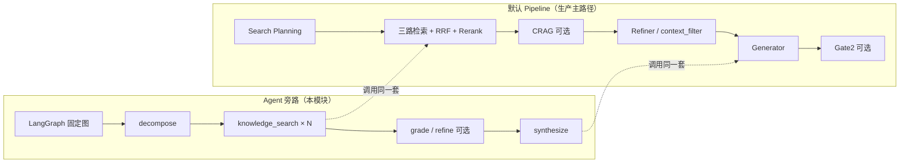

| 能力 | 位置 | 与 Agent 关系 |
|------|------|----------------|
| Search Planning | 检索内部 | `knowledge_search` **内部仍走**，不对 LLM 暴露选路 |
| CRAG | 检索后纠错 | **不**并入主图；保持独立开关 |
| Self-RAG Gate2 | 生成后忠实性 | **不**并入主图；可后续后置 |
| Agent Graph | 新旁路 | 编排「何时搜、搜几次、是否拆问」 |

---

## 3. 系统上下文

客户端仍只打 **`POST /ask`**。是否走 agent 由 **配置总开关 + 请求 mode** 共同决定。

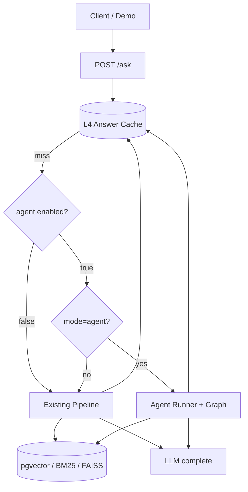

| 条件 | 路径 | 响应 `agent` 字段 |
|------|------|-------------------|
| `enabled=false`（默认） | 始终 pipeline | `null`（或 `used=false` + ignored_reason） |
| `enabled=true` 且 `mode=pipeline` | pipeline | `null` |
| `enabled=true` 且 `mode=agent` | LangGraph | 含 trajectory / subqueries / counts |

L4 key 必须含 **`mode` + `agent_cache_salt`**，避免 pipeline 与 agent 答案串缓存。

---

## 4. 分层架构

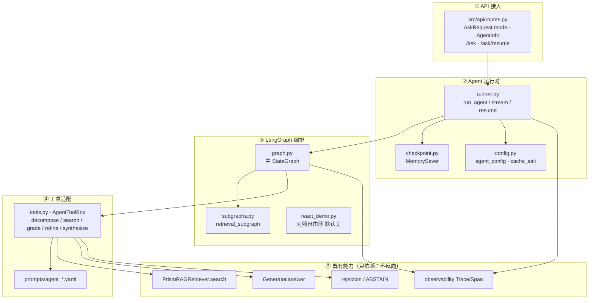

**依赖纪律：** `api → agent → retrieval/generation`。禁止 `retrieval` import `agent`。黄金 NDCG / 消融主路径不挂 agent。

---

## 5. 主图拓扑（业务状态机）

核心不是「LLM 随意选工具」，而是 **图结构决定阶段**；LLM 主要填参（拆问 JSON、grade JSON、生成答案）。

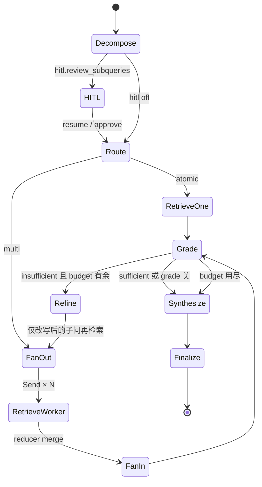

### 5.1 节点说明

| 节点 | 输入 | 输出 | 实现要点 |
|------|------|------|----------|
| **decompose** | 原问 | `subqueries[]`, `strategy` | LLM + JSON；失败 → `[query]` |
| **HITL**（可选） | 待审子问 | 确认/修订子问 | `interrupt` + checkpoint；默认关 |
| **route** | strategy / len | atomic \| multi | 纯规则条件边 |
| **retrieve_one** | 单问 | evidence | 一次 `knowledge_search` |
| **fan_out / worker** | N 子问 | 各路 hits | **Send API** 并行；预算截断 |
| **grade** | 原问 + evidence | sufficient / missing | 可配置短路 always sufficient |
| **refine** | missing + 子问 | 新子问 | 禁止 HyDE/web；环次数硬顶 |
| **synthesize** | 原问 + evidence | answer + citations | `Generator`；空证据拒答 |
| **finalize** | 全状态 | counts / 截断 trajectory | 填 API 元数据 |

### 5.2 护栏（图外强制，不靠模型自觉）

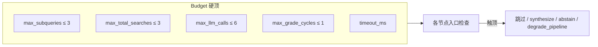

---

## 6. 状态与数据流

### 6.1 AgentState（概念）

| 字段 | 合并方式 | 含义 |
|------|----------|------|
| `query` | 覆盖 | 用户原问 |
| `subqueries` | 覆盖 | 拆出的子问 |
| `evidence` | **append reducer** | 各路检索 hit 追加 |
| `trajectory` | **append reducer** | 逐步 StepRecord |
| `budget` | 覆盖 | 剩余 search/llm/grade 次数 |
| `answer` / `citations` / `status` | 覆盖 | 终态 |
| `meta` | 合并 | trace_id、计数等 |

**Send 并行要点：** worker 只返回 **本路增量** 的 `evidence`/`trajectory`，由 reducer 合并；不要回传全量列表，否则会重复。

### 6.2 多跳一次请求的数据流

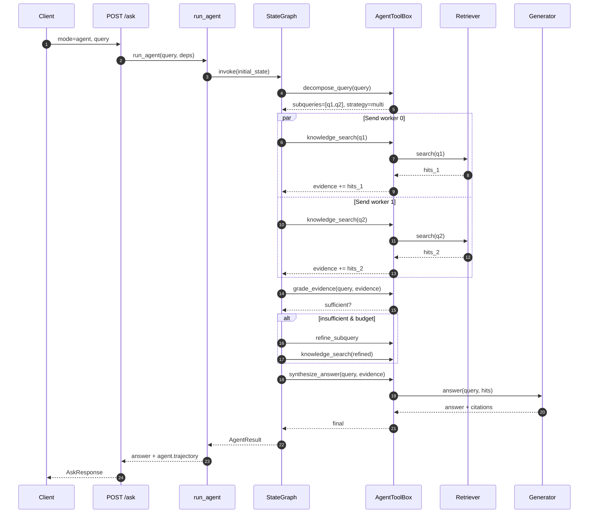

### 6.3 原子题捷径

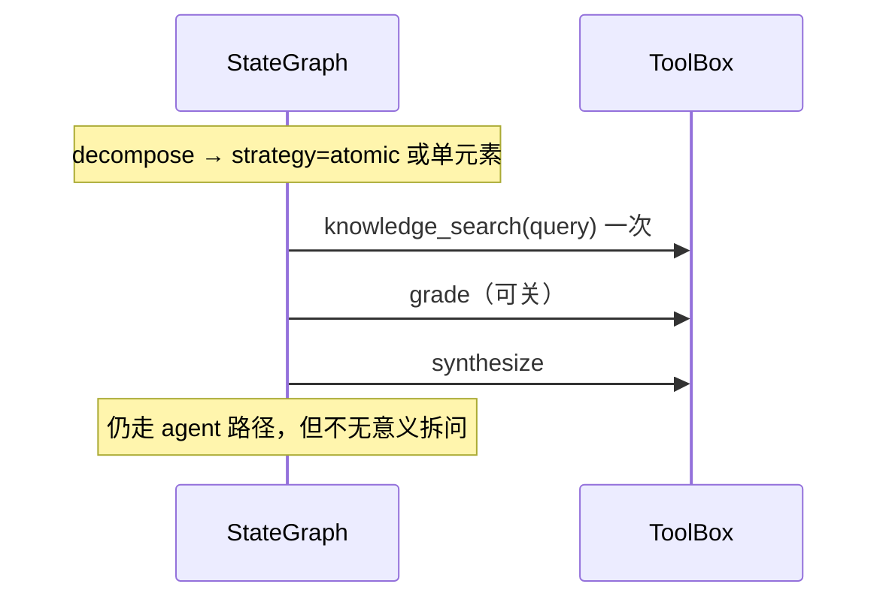

---

## 7. 工具契约（窄工具面）

主路径工具由 **节点调用**，不是 ReAct 每步自选（学习向 `react_demo` 除外）。

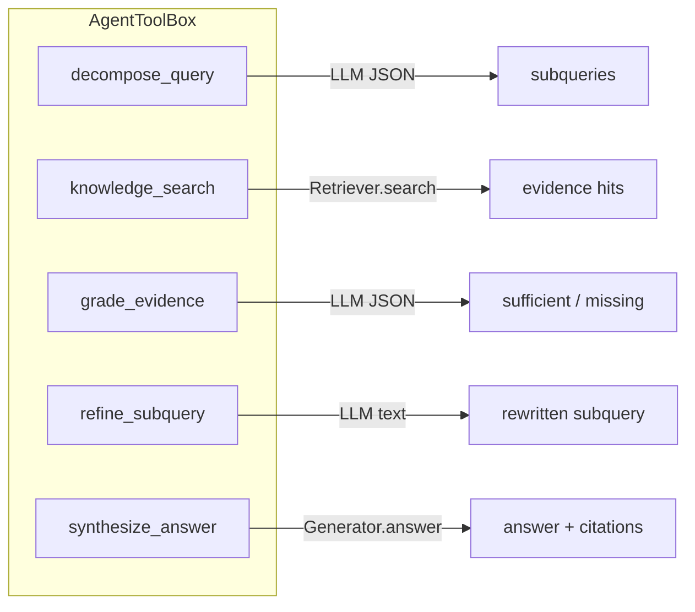

| Tool | LLM? | 失败策略 |
|------|------|----------|
| `decompose_query` | 是 | fallback `subqueries=[query]` |
| `knowledge_search` | 否（检索） | 该子问跳过，记 trajectory error |
| `grade_evidence` | 是 | 解析失败 → pass-through sufficient（防误杀） |
| `refine_subquery` | 是 | 保留原子问 |
| `synthesize_answer` | 生成模型 | 空证据 → 统一拒答口径 |

---

## 8. 模块与文件（落地目标）

```text
src/agent/
  config.py       # agent.* 默认；agent_cache_salt()
  state.py        # AgentState · StepRecord · reducers
  tools.py        # AgentToolBox（可注入 search/complete/generate）
  subgraphs.py    # retrieval_subgraph
  graph.py        # 主 StateGraph 编译
  checkpoint.py   # MemorySaver
  runner.py       # run_agent / stream_agent / resume_agent
  react_demo.py   # 可选对照图
  eval.py         # agent_answer_for_eval（Phase2）

src/api/routes.py          # mode 分支 · AgentInfo · /ask/resume
src/prompts/prompts/agent_*.yaml
config/models.yaml         # agent: enabled false ...
```

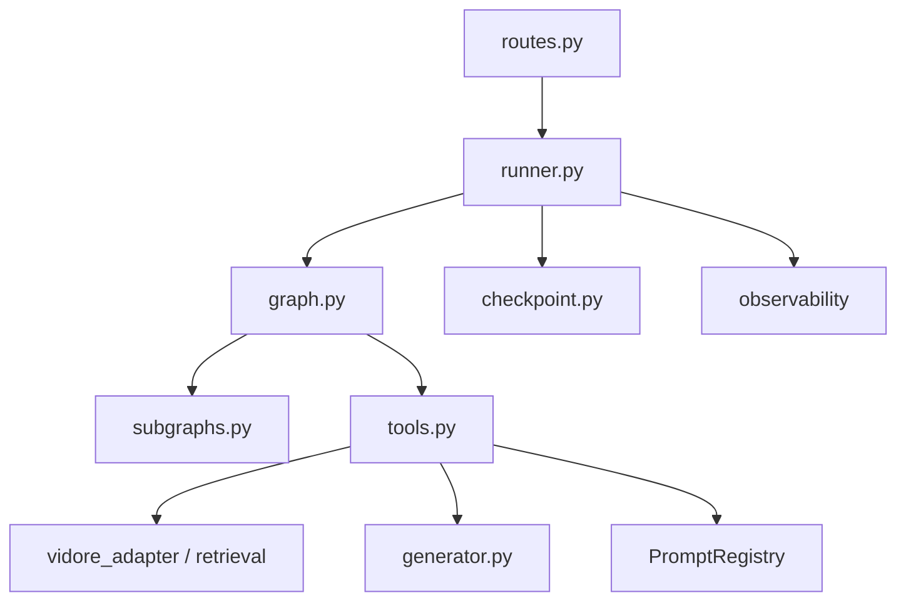

---

## 9. 配置与开关

| 键 | 默认 | 作用 |
|----|------|------|
| `agent.enabled` | **false** | 总开关；false 时忽略 `mode=agent` |
| `agent.max_subqueries` | 3 | 拆问上限 |
| `agent.max_total_searches` | 3 | 全图检索次数上限 |
| `agent.max_search_per_subquery` | 1 | 每子问检索次数 |
| `agent.max_llm_calls` | 6 | LLM 调用预算 |
| `agent.max_grade_cycles` | 1 | grade⇄refine 环 |
| `agent.grade.enabled` | true | 学习环需要；评测可关对照 |
| `agent.checkpoint.enabled` | true | 进程内 MemorySaver |
| `agent.hitl.review_subqueries` | **false** | decompose 后人工确认 |
| `agent.react_demo.enabled` | **false** | 自由 ReAct 对照图 |
| `agent.on_error` | `degrade_pipeline` | 图崩溃 → 回退 pipeline |
| `agent.return_trajectory` | true | 响应是否带 trajectory |
| `agent.timeout_ms` | 30000 | 整图软超时 |

**纪律：** 与 CRAG / Gate2 相同——**默认关**；改默认必须云上子集对照 + handoff 决议。

---

## 10. API 与响应形状

```text
POST /ask
  body: { query, mode?: "pipeline"|"agent", k, doc_id, ... }

AskResponse.agent: null | {
  used, status,          # ok | abstain | error | degraded | interrupted
  subqueries[],
  trajectory[],          # StepRecord
  counts: { subqueries, searches, llm_calls, evidence_n },
  degraded_to_pipeline,
  thread_id,
  ignored_reason
}

POST /ask/resume         # 仅 HITL：thread_id + 可选修订 subqueries
```

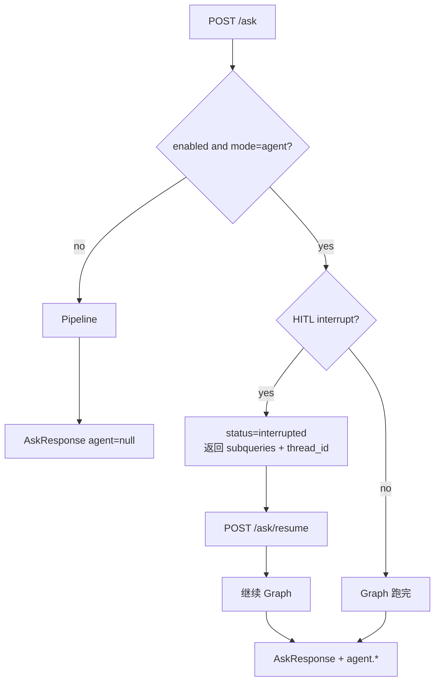

---

## 11. 可观测与排障

| 层 | 看什么 |
|----|--------|
| **响应 body `agent.trajectory`** | 拆了哪些问、搜了几次、grade 结果、耗时 |
| **Observability Span** | `agent` / `decompose` / `search[i]` / `grade` / `synthesize` |
| **X-Trace-Id** | 与现网一致，挂 agent metadata |
| **L4 未命中但答案怪** | 查 cache salt 是否含 `ag=` 与 mode |

**二分：**

1. `subqueries` 是否离谱？ → decompose / prompt  
2. 子问合理但 hit 空/错？ → 检索栈（与 pipeline 同核）  
3. evidence 够但答案胡？ → synthesize / Generator  
4. 延迟爆？ → counts.searches / llm_calls / grade 是否多余环  

---

## 12. LangGraph 特性如何挂在图上

便于对照学习 / 面试口述：

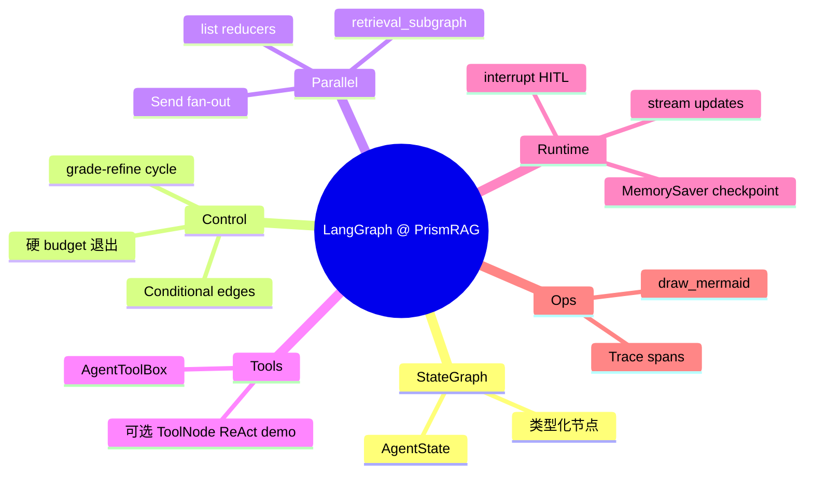

| 特性 | 落点 |
|------|------|
| StateGraph + State | `graph.py` / `state.py` |
| Conditional edges | route atomic/multi；grade 出口 |
| Cycles | grade → refine → retrieve |
| Reducers | `evidence` / `trajectory` append |
| Send map-reduce | 多子问并行 search |
| Subgraph | `retrieval_subgraph` |
| Tools | `tools.py`；`react_demo` 对照 |
| Checkpoint | `MemorySaver` + `thread_id` |
| Stream | `stream_agent` / demo |
| interrupt | HITL 审子问 |
| 可视化 | `get_graph().draw_mermaid()` → [agent-graph.mmd](./agent-graph.mmd) |

**明确不做：** Store 长期记忆、多 Agent 监督网络、web_search。

### 12.1 Feature Map 自检表（Phase1 验收 · 2026-08-03）

本地验收命令：

```bash
.venv/bin/python -m pytest tests/test_agent_*.py tests/test_api.py tests/test_demo_fixtures.py -q
# → 57 passed
```

| 特性 | 验证命令/操作 | 状态 |
|------|----------------|------|
| StateGraph | `tests/test_agent_graph.py::test_graph_compile_and_invoke_atomic` | ✅ |
| Conditional edges | `test_route_atomic` · `test_route_grade` | ✅ |
| Cycles | `test_route_grade`（insufficient→refine；budget 0→synthesize）；`max_grade_cycles` 配置 + invoke | ✅ |
| Reducers | `test_merge_evidence_appends`；`test_multi_uses_send_or_equivalent_n_searches` evidence len==2 | ✅ |
| Send | `test_multi_uses_send_or_equivalent_n_searches`（`meta.use_send` + N 次 search） | ✅ |
| Subgraph | `src/agent/subgraphs.py` via Send worker；轨迹节点 `retrieval_worker`（无独立 `test_subgraphs_*`，由 multi Send 覆盖） | ✅ |
| @tool / ReAct demo | `tests/test_agent_react_demo.py`（默认 off；compile + max_steps） | ✅ |
| Checkpoint + HITL | `tests/test_agent_checkpoint_hitl.py::test_interrupt_and_resume` · `test_resume_with_revised_subqueries` | ✅ |
| Stream | `test_stream_agent_yields_events` | ✅ |
| Mermaid | `docs/architecture/agent-graph.mmd` 存在；`test_export_graph_mermaid` | ✅ |
| API mode=agent | `tests/test_agent_api.py`（disabled 忽略 / enabled 返回 trajectory / L4 salt / resume） | ✅ |
| Demo fixtures | `tests/test_demo_fixtures.py::test_agent_fixture_has_trajectory` | ✅ |
| Eval 骨架 | `tests/test_agent_eval.py` + `data/agent_eval_qa.json` | ✅ |

**Phase2 工具链（2026-08）：** `data/agent_eval_qa.json` ~46 条；`scripts/run_agent_eval.py --execute`；`scripts/cloud_agent_eval.sh`。  
**云上双臂数字 / Go 决议仍未做** → **无 Go 前禁止 `enabled: true`。**

---

## 13. 错误与降级

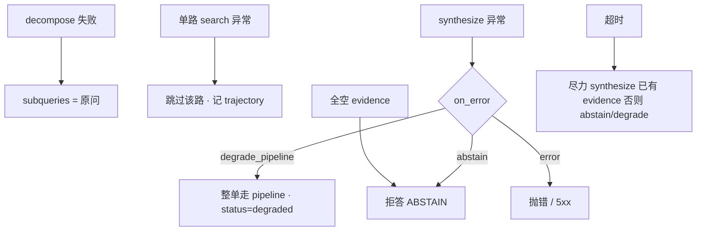

---

## 14. 评测位置（三轨：mock · 本机轻量真链路 · 云上子集）

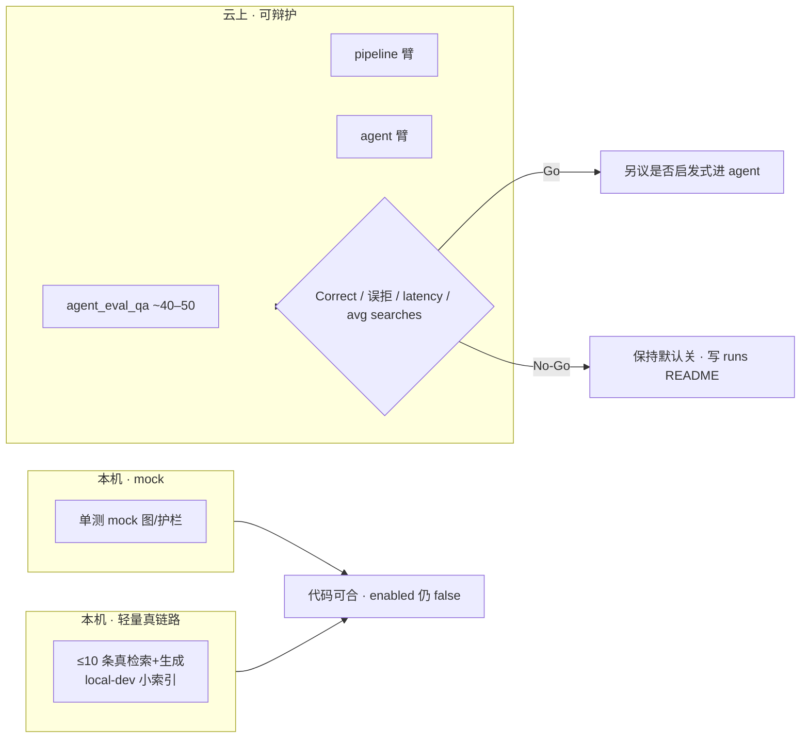

- **L1 NDCG / 黄金消融：永不走 agent。**  
- Phase2 子集建议：multi_hop + atomic + reject ≈ 40–50 条。  
- **本机轻量真链路：数据量小就允许**（见 §14.1）；**不**用本机分数单独决定 `enabled: true`。

### 14.1 本机轻量真链路协议（已确认可做）

> 对齐 AGENTS.md：允许「`--max-queries 10` 以内的轻量验证」；禁止本机全量 283 / 全量 RAGAS / 无缓存下大模型。

| 项 | 约定 |
|----|------|
| **目的** | 接口通、轨迹合理、延迟量级、拆问/多搜是否按预算；**冒烟**而非上线决议 |
| **规模** | **≤10 条 query**（推荐 3～5 先通，再拉到 10） |
| **语料** | `local-dev` 小索引 / 单份 demo PDF（如 `indexes/local-demo-colqwen2*` + `CONFIG_PROFILE=local-dev`） |
| **模型** | 已缓存即可：Ollama `qwen2:7b` 等；**禁止**为冒烟触发新增大模型下载 |
| **对照** | 同 3～10 条：`mode=pipeline` vs `mode=agent`（agent 需临时 `agent.enabled=true` 或 env 覆盖） |
| **看什么** | HTTP 200；`agent.subqueries` / `trajectory`；`counts.searches` ≤ budget；有无 degrade；主观答案是否离谱 |
| **不看什么** | 不报 NDCG；不把 10 条 Correct 当 Phase2 结论 |
| **归档** | 可选 `runs/YYYYMMDD-agent-local-smoke/` 记命令与 2～3 条轨迹摘要 |

**前置检查（有则跑，无则只 mock）：**

```bash
# 1) 配置与服务
export CONFIG_PROFILE=local-dev   # 见 config/models.local-dev.yaml
# ollama serve 且 ollama list 已有目标模型（不 pull 新模型）
# make db 或既有 pgvector；local-demo 索引已存在则 -- 不必 re-ingest

# 2) 单测仍是底线
.venv/bin/python -m pytest tests/test_agent_*.py -q

# 3) API 冒烟（实现后；agent.enabled 临时 true）
# curl pipeline
curl -s localhost:8000/ask -H 'Content-Type: application/json' \
  -d '{"query":"<短问>","mode":"pipeline","k":5}'
# curl agent
curl -s localhost:8000/ask -H 'Content-Type: application/json' \
  -d '{"query":"<复合短问>","mode":"agent","k":5}'
```

实现阶段可提供 `scripts/run_agent_local_smoke.py`（或 Makefile 目标）：读 `data/agent_eval_qa.json` 里 **tag 过滤后的前 N 条（N≤10）**，双 mode 输出 JSON；**默认 N=5**。

---

## 15. 与 pipeline 对照（心智模型）

| 维度 | Pipeline | Agent |
|------|----------|-------|
| 控制流 | 线性固定 | 固定图 + 有限分支/环 |
| 检索次数 | 通常 1 次融合检索 | 1..N 次（按子问） |
| 决策者 | 规则 + 配置 | 图结构 + 少量 LLM 填参 |
| 延迟 | 低 | 更高（受 budget 约束） |
| 适用 | 单跳事实、主流量 | 复合/多跳、演示可控编排 |
| 默认 | **开（现网）** | **关** |

一句话：**Pipeline 求稳求快；Agent 求「可解释的多步检索编排」，并用硬顶防止变成不可控 agent。**

---

## 16. 关键链接

| 文档 | 关系 |
|------|------|
| [Spec 设计](../superpowers/specs/2026-08-03-agentic-rag-langgraph-design.md) | 决策全文 |
| [实现计划](../superpowers/plans/2026-08-03-agentic-rag-langgraph.md) | Task 0–12 |
| [Self-RAG 闭环](../self-rag-closed-loop-design-2026-07-09.md) | Gate2 / CRAG 背景 |
| [Cache](./cache.md) | L4 盐与失效 |
| [Trace](./trace.md) | 请求级排障 |
| [长期路线图 Agent 节](../superpowers/specs/2026-06-30-prismrag-longterm-roadmap-design.md) | 历史 ReACT 规划（本实现以 LangGraph 固定图落地，不建 KG） |

---

## 17. 已知限制与演进

| 项 | 现状 | 可能演进 |
|----|------|----------|
| 子问独立并行 | MVP | 串行依赖填槽（v1.1） |
| Checkpoint | 进程内 MemorySaver | 跨 worker 持久化 |
| grade 默认 | 配置 true（学习） | Phase2 后可能默认 false |
| ReAct | 仅 demo 开关 | 不进生产默认 |
| 自动路由进 agent | 无（显式 mode） | 启发式 multi-hop 检测 |

实现源码：`src/agent/`（config · state · tools · graph · subgraphs · runner · checkpoint · react_demo · eval）。Mermaid 导出见 [agent-graph.mmd](./agent-graph.mmd)。
