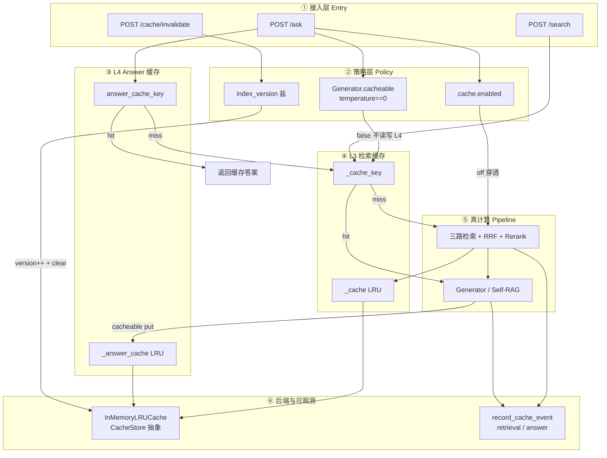
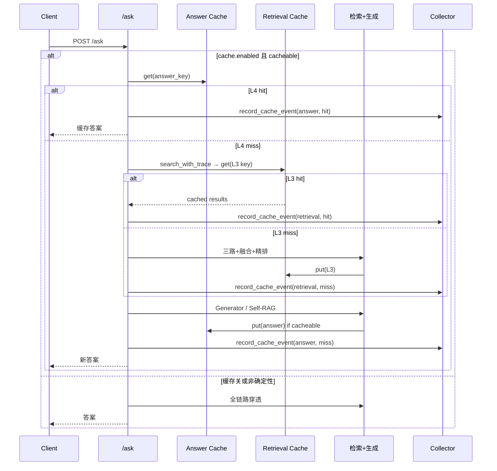

# Cache — 查询期 L3/L4 旁路缓存

> 状态：与当前实现对齐（`src/cache/`、`search_with_trace`、`/ask`）  
> 更新：2026-07-22  
> 配套 Spec（方案细节）：`docs/cache-retrieval-spec-2026-07-18.md`  
> 本文偏 **当前实现架构快照**；Spec 偏设计决策与验收清单。

---

## 1. 一句话职责

对**重复查询**做两层旁路缓存：**L3 跳过三路检索+融合+精排**，**L4 跳过整次 LLM 生成**；语料变更后通过 **`index_version` 版本盐**保证零脏读，不依赖 TTL 做正确性。

---

## 2. 边界

| 做 | 不做 |
|----|------|
| L3 检索结果缓存（`search_with_trace`） | L1 query embedding 缓存（未做） |
| L4 Answer 缓存（`/ask`，`temp==0`） | 多 worker 共享 Redis（仅预留接口） |
| `index_version` 盐 + `invalidate` 清空 | 用 TTL 作为语料一致性主手段 |
| 命中率可观测（`record_cache_event`） | 磁盘 spill / 分布式缓存集群 |
| 全局 `cache.enabled` 门控 L3/L4 | 改造 HyDE dict / 入库期表摘要缓存 |

### 与其它「缓存」的边界

| 名称 | 时期 | 说明 |
|------|------|------|
| **L3 / L4** | 查询 | 本文主角 |
| HyDE `dict` | 查询 | 改写结果复用；独立实现，Spec 明确不动 |
| 表格摘要 `lru_cache` | 入库 | 少打 LLM |
| FAISS page embeddings | 入库 | 索引资产持久化，非请求缓存 |

### 两层命中语义

| 层 | 命中时跳过 | ROI |
|----|------------|-----|
| **L4 Answer** | 检索 + 生成（含 Self-RAG） | 最大：省整次 LLM |
| **L3 Retrieval** | BM25/Dense/Visual + RRF + Rerank | 同 query 换生成参数时仍省检索 |

---

## 3. 分层架构



### 层职责（一层一句）

| 层 | 职责 |
|----|------|
| ① 接入 | `/ask` 走 L4→L3；`/search` 主要走 L3；运维主动 invalidate |
| ② 策略 | 总开关、答案确定性守卫、版本盐 |
| ③ L4 | 整答缓存；命中则整段返回 |
| ④ L3 | 检索结果缓存；命中则跳过重计算检索 |
| ⑤ 真计算 | miss 时的源路径 |
| ⑥ 后端 | 进程内 LRU + 命中事件上报 |

---

## 4. 数据结构（树状）

### 4.1 后端与挂载

```text
CacheStore                              # 抽象接口
├── get(key) → Any | None
├── put(key, value)
└── clear()

InMemoryLRUCache(CacheStore)
├── max_size: int                       # 默认 2048
├── ttl_seconds: int                    # 默认 0 = 不启用 TTL
├── OrderedDict[key → (value, expire_at|None)]
└── RLock                               # 线程安全

PrismRAGRetriever
├── index_version: int                  # 版本盐，初始 0
├── _cache: InMemoryLRUCache | None     # L3
└── _answer_cache: InMemoryLRUCache | None  # L4
```

### 4.2 Key 维度（概念）

```text
L3 key ≈ f(
  归一化 query,
  k,
  各路检索开关 / reranker_type / 相关配置,
  index_version                         # ★ 语料版本
)

L4 key ≈ f(
  归一化 query,
  model,
  k / k_context,
  doc_id?,
  index_version,
  self_rag_cache_salt?                  # 开/关与门参数变化不得串答案
)
```

**原则：** key 必须包含所有影响结果的维度；漏一维会串结果（脏读）。  
**后处理：** 部分确定性后置过滤可不进 key（见 Spec §6 C1）。

### 4.3 失效

```text
invalidate_cache()
├── index_version += 1                  # 逻辑失效：旧 key 拼不出来
├── _cache.clear()                      # 物理清空 L3
└── _answer_cache.clear()               # 物理清空 L4

触发点
├── delete_document(...)                # 语料删除，内联
└── POST /cache/invalidate              # 重索引 / 批量变更后运维触发
```

正确性语义：**版本盐优先于 TTL**；`ttl_seconds=0` 为推荐配置。

### 4.4 L4 值形态（概念）

```text
answer_cache value
├── answer: str
├── citations: list
├── retrieval_trace: dict
└── self_rag?: dict                     # 若当次走了 Gate2
```

---

## 5. 主路径

### 5.1 `/ask` 时序



### 5.2 请求路径简图

```text
POST /ask
  → ① L4 get
       ├─ hit  → return
       └─ miss → ② L3 get（search_with_trace）
                    ├─ hit  → 用缓存 Top-K
                    └─ miss → 真检索 → put L3
                 → ③ 生成
                 → ④ cacheable → put L4
```

---

## 6. 关键代码

| 路径 | 角色 |
|------|------|
| `src/cache/store.py` | `CacheStore` / `InMemoryLRUCache` |
| `src/config.py` | `CacheConfig`（enabled / max_size / ttl_seconds） |
| `src/evaluation/vidore_adapter.py` | L3 包裹 `search_with_trace`；`_cache_key`；`invalidate_cache` |
| `src/api/routes.py` | L4 读写 `/ask`；`POST /cache/invalidate` |
| `src/generation/generator.py` | `cacheable`（`temperature==0`） |
| `src/generation/self_rag.py` | `self_rag_cache_salt`（L4 key 盐） |
| `src/observability/collectors.py` | `record_cache_event`；命中率聚合 |

部署假设：单 `uvicorn` worker（无多 worker 时进程内缓存即可保证正确性）。

---

## 7. 配置与开关

| 配置 | 含义 | 推荐 |
|------|------|------|
| `cache.enabled` | L3/L4 总开关 | 开 |
| `cache.max_size` | LRU 条目上限 | 2048 |
| `cache.ttl_seconds` | >0 惰性过期；**正确性不依赖它** | **0** |
| `Generator.temperature` | `==0` 才读写 L4 | 生产确定性生成用 0 |

---

## 8. 排障 / 运维入口

| 场景 | 动作 |
|------|------|
| 删文档后仍答旧内容 | 确认 `delete_document` 是否调了 `invalidate_cache`；查 `index_version` |
| 重索引后 | `POST /cache/invalidate` |
| 怀疑串答案 | 查 L4 key 是否含 model / self_rag 盐 / index_version |
| 命中率异常 | Collector：`retrieval_cache_hit_rate` / `answer_cache_hit_rate`；单请求 cache 事件 |
| 多副本部署 | 进程内缓存不共享 → 需 Redis 或粘性会话（当前未实现） |

---

## 9. 已知限制与演进

| 限制 | 说明 |
|------|------|
| 多 worker 不共享 | 各进程独立 LRU，命中率稀释 |
| Redis 未实现 | `CacheStore` 预留扩展点 |
| 无 L1 embedding 缓存 | Spec §11 后续增强 |
| 大 value 占内存 | 仅靠 max_size 淘汰，无磁盘 spill |
| temp>0 | L4 禁用，避免缓存非确定答案 |

可选演进：RedisCache、L1 query embedding、磁盘 spill、与 Trace 在 `/trace` 视图中合并展示 cache 段。

---

## 10. 口述 20 秒

> 查询期两层旁路缓存：L4 缓存整答（仅 temp=0），L3 缓存检索结果。  
> Key 带 index_version，删文档或 invalidate 升版本并清空，不靠 TTL 保证正确。  
> 进程内 LRU 适合单 worker；命中率进 Collector，和可观测打通。

---

## 11. 设计原则速查

| 原则 | 落地 |
|------|------|
| 旁路 cache-aside | 先 get，miss 再算，再 put |
| 版本盐 > TTL | `index_version` 进 key + invalidate clear |
| key 全维度 | 漏维会脏读 |
| 确定性守卫 | L4 仅 `cacheable` |
| 单进程默认 | InMemoryLRU；Redis 预留 |
