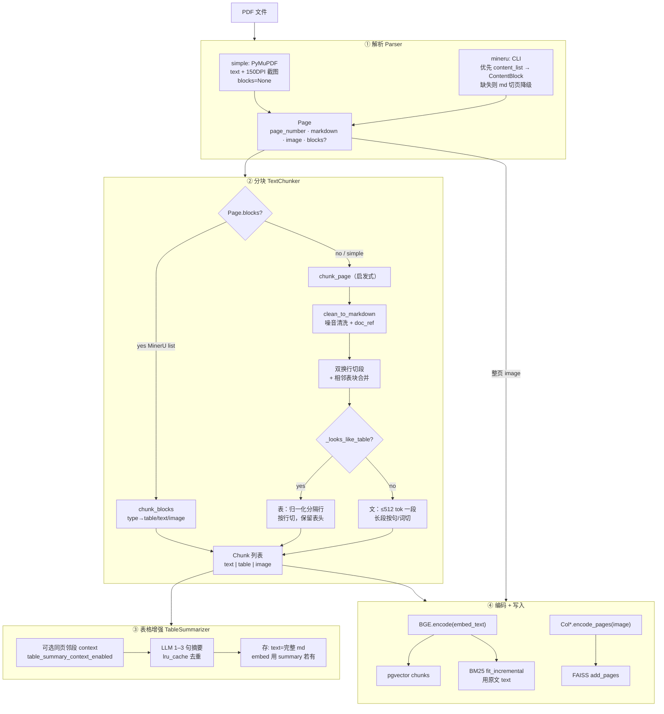
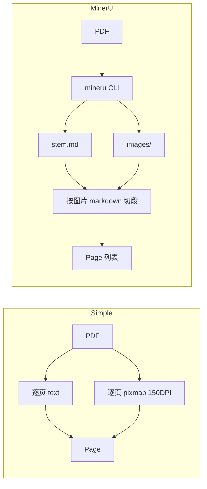
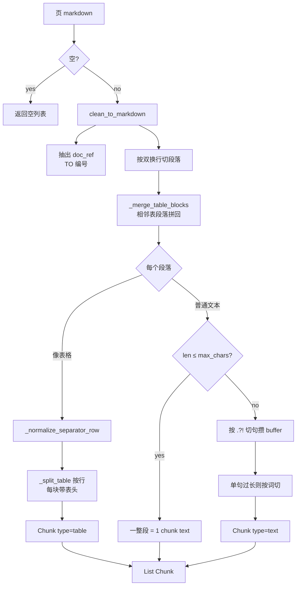
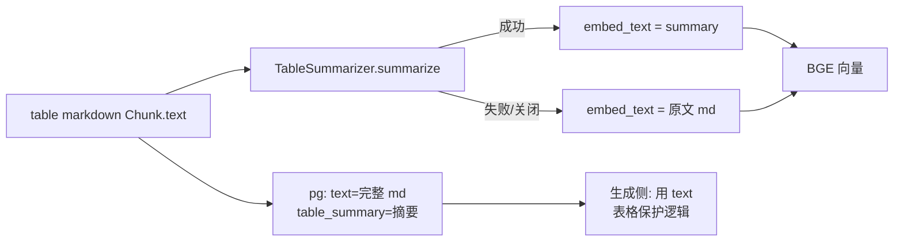
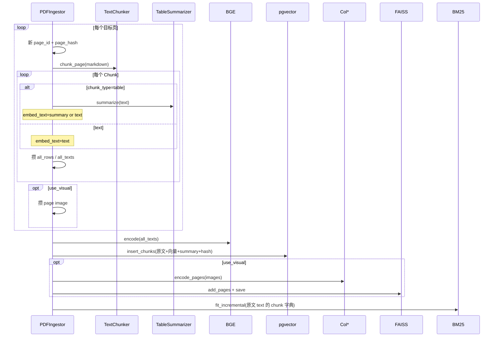
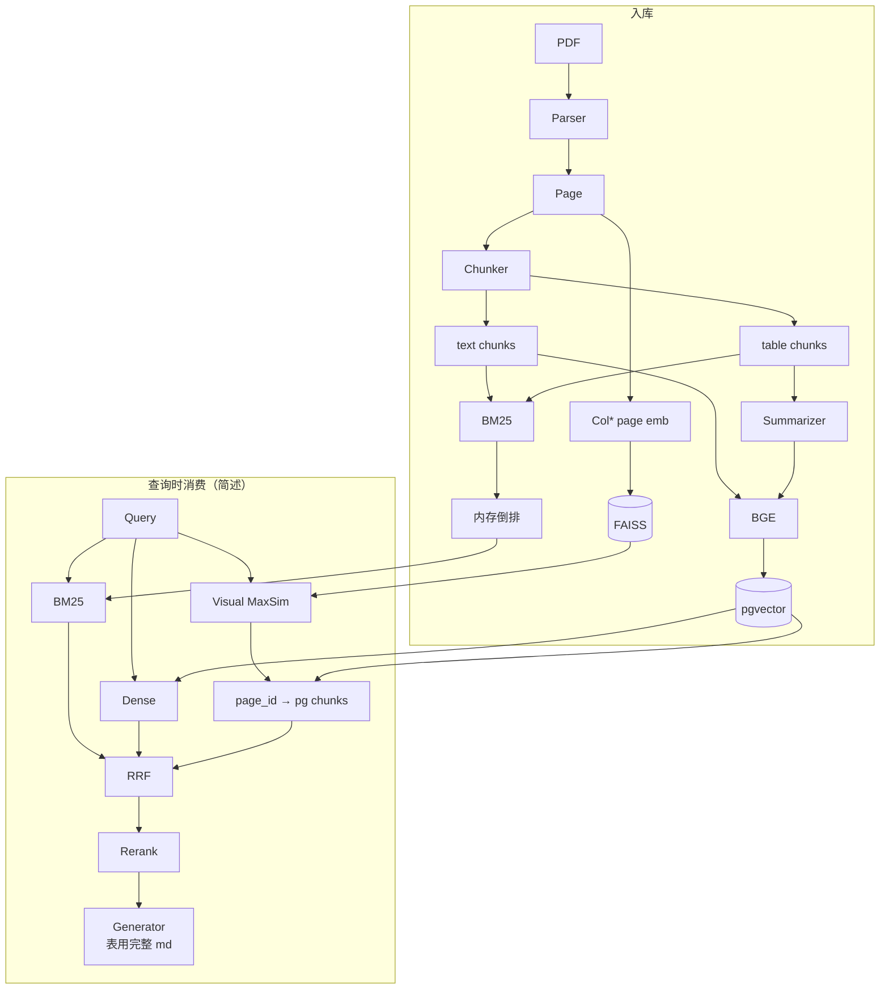

# Content Pipeline — PDF / 图表 / 表格入库与分块

> 状态：与当前实现对齐（`parser` · `text_chunker` · `table_summarizer` · `pdf_ingestor._ingest_pages`）  
> 更新：2026-07-22  
> 配套：索引生命周期与三路一致见 [ingestion.md](./ingestion.md)；表摘要设计见 `docs/table-summary-large-table-design-2026-07-09.md`  
> 本文回答面试题：**PDF/图表/表格如何入库？chunk 怎么切？整条链路怎么串？**

---

## 1. 一句话职责

把一页 PDF 拆成 **两条并行资产**：

| 资产 | 来自 | 粒度 | 去向 |
|------|------|------|------|
| **文本/表格 chunk** | 页内 markdown | chunk | BGE → pgvector + BM25（原文） |
| **整页视觉向量** | 页截图 `image` | page | ColPali/ColQwen2 → FAISS |

图表主要靠 **整页 Visual**（不单独抠图建库）；表格靠 **markdown 表结构 chunk + 可选 NL 摘要 embed**。  
表摘要可选 **同页邻段上下文**（`ingestion.table_summary_context_enabled`，默认关；见 Phase A1 路线图）。

---

## 2. 边界

| 做 | 不做 |
|----|------|
| 解析出 `Page(markdown, image)` | OCR 独立流水线（依赖 MinerU/PyMuPDF） |
| 清洗 + 段落/表格分块 | 跨页合并 chunk、文档级大纲树 |
| 表：保留 markdown + 摘要向量 | 把表当纯图进 Col* 单独索引 |
| 图/版式：整页截图进 Visual | 图块级目标检测 + 单独 embedding 库 |
| 编码写入三路 | 在线检索融合（属 Retrieval） |

---

## 3. 总览：整条链路怎么串



### 串起来的「一页」心智模型

```text
                    Page
                   /    \
          markdown        image (整页截图)
             │                 │
             ▼                 ▼
      TextChunker          ColPali/ColQwen2
      text / table chunks     多向量 / 页
             │                 │
     table → 摘要(可选)        │
             │                 │
        BGE(embed_text)        │
             │                 │
     ┌───────┴───────┐         │
     ▼               ▼         ▼
  pgvector         BM25      FAISS
  (向量+原文)     (原文分词)  (页向量)
```

**关键接缝（面试常问）：**  
Visual 只知道「哪一页相关」；真正喂 LLM 的字，来自同 `page_id` 的 pg chunk。这是 Visual → 文本 grounding 的工程接缝（检索侧实现，入库时通过共享 `page_id` 埋下）。

---

## 4. ① PDF 如何解析

### 4.1 统一产物 `Page`

```text
Page
  ├── page_number: int     # 1-based
  ├── markdown: str        # 页文本（simple 为纯 text；mineru 为 md，可含表格）
  └── image: PIL.Image     # 整页渲染图（图表/版式进 Visual 的唯一输入）
```

**没有**单独的 `Chart` / `Figure` 类型：图在页里，靠截图 + 视觉模型「看见」。

### 4.2 两种 Parser

| | `simple`（默认/本地 dev） | `mineru`（生产向） |
|--|--------------------------|-------------------|
| 实现 | `SimplePDFParser` | `MinerUParser` |
| 文本 | PyMuPDF `get_text` | MinerU 产出 `.md` |
| 图 | `get_pixmap(dpi=150)` | 输出 `images/*.png` 按 md 图位切页 |
| 依赖 | 仅 PyMuPDF | 需 `mineru` CLI |
| 配置 | `ingestion.parser: simple` | `ingestion.parser: mineru` |



入口：`build_parser()` ← `cfg["ingestion.parser"]`。

---

## 5. ② Chunk 怎么切

入口：`TextChunker.chunk_page(page_id, doc_id, page_number, markdown_text)`。

### 5.1 总流程（一页内）



### 5.2 尺寸规则

| 参数 | 值 | 说明 |
|------|-----|------|
| `MAX_TOKENS` | **512** | 目标上限 |
| `TOKEN_EST_RATIO` | 4 | 英文约 4 chars/token |
| `max_chars` | **2048** | `512 × 4`，实现里用字符长度近似 token |

**文本：**

1. 短段（`len ≤ max_chars`）→ 1 chunk  
2. 长段 → 按 `(?<=[.?!])\s+` 切句，buffer 累加至上限再落盘  
3. 单句仍超长 → 按空格分词再切  

**表格：** 不按词硬切（会破坏 `|---|` 对齐），见 §6。

### 5.3 预处理 `clean_to_markdown`（TO 手册噪音）

面向工业/ViDoRe 类手册，顺序清洗：

| 步 | 作用 |
|----|------|
| 抽 `doc_ref` | 首个 `TO …` 引用，供 grounding（**不进** CtxRel 评估口径） |
| 断词修复 | `word-\nword` → `wordword` |
| 去空单元格表碎片行 | 如 `\|  \| TO WP … \|`，**保留**正常 md 表 |
| 去 TO 引用行 / 纯文档编号行 | 减检索噪音 |
| 去全大写短行 | 章节标题类 |
| 压缩 ≥3 空行 | → 双换行 |

### 5.4 Chunk 对象

```text
Chunk
  ├── chunk_id      # pg{page_id:05d}_ch{idx:03d}
  ├── page_id / doc_id / page_number
  ├── text          # 原文（表=完整 markdown 片段）
  ├── chunk_type    # "text" | "table"
  ├── doc_ref       # 页级 TO 编号（可空）
  └── table_summary # 入库时由 Summarizer 填；chunk 初建可为空
```

---

## 6. ③ 表格如何入库

### 6.1 识别

`_looks_like_table`：前 5 行 `|` 计数 **≥ 3** → 当表格处理。

### 6.2 结构保护

| 步骤 | 目的 |
|------|------|
| `_merge_table_blocks` | 空行拆开的相邻表段拼回，避免表头/分隔行掉队 |
| `_normalize_separator_row` | 缺 `\|---\|` 时按表头列数注入 GFM 分隔行；支持 caption 贴表头 |
| `_split_table` | 超长表 **按数据行** 切；**每块复制 header+sep**，列语义不丢 |

```text
长表切分示意：
  | ColA | ColB |     ← 每块都带
  | ---- | ---- |
  | r1   | ...  |     ← 块1 部分行
  --- 下一 chunk ---
  | ColA | ColB |
  | ---- | ---- |
  | r50  | ...  |     ← 块2 部分行
```

### 6.3 双表示：检索摘要 vs 生成原文



| 字段 | 用途 |
|------|------|
| `text` | 完整 markdown 表；**BM25 用它**；生成入模优先用它（结构） |
| `table_summary` | NL 摘要；**Dense embed 优先用它**（语义更好、向量更稳） |
| BGE 输入 | `summary if summary else text`（`pdf_ingestor`） |

`TableSummarizer`：

- Prompt：`src/prompts/prompts/table_summary.yaml`  
- `lru_cache(maxsize=2048)` 相同表不重复打 LLM  
- 任意异常 → `""`，**不阻塞入库**  
- 开关：`ingestion.table_summary_enabled`（默认 True）

### 6.4 生成侧呼应（入库时埋下的约定）

生成压缩时对 `chunk_type==table` **保护整表 markdown**（`generator.py`），避免句级过滤把表切烂。  
入库写 `chunk_type=table` + 完整 `text` 就是为这一步服务。

---

## 7. ④ 图表 / 版式如何入库

**没有独立「图 chunk 表」。**

| 内容 | 策略 |
|------|------|
| 示意图、曲线、截图、复杂版式 | 整页 `Page.image` → Col* → FAISS |
| 图注/旁白文字 | 若解析进 `markdown` → 普通 text chunk |
| `use_visual=false` | 跳过视觉路；图依赖文本侧能否抽到字 |

```text
图表密集页：
  Visual 召回 page_id
       → 反查该页全部 text/table chunk
       → 拼 grounding 上下文
```

页级 `page_hash` 优先用 **图像 tobytes**，版式/图变更会触发 page-diff 重编码（见 [ingestion.md](./ingestion.md)）。

---

## 8. ⑤ `_ingest_pages`：编码与写入如何串

对指定 `page_numbers` 子集（全量或 page-diff 的 changed+new）：



### 三路写入对照

| 路 | 输入内容 | 粒度 |
|----|----------|------|
| Dense (pg) | table→摘要优先，否则原文 | chunk |
| BM25 | **始终原文** `text`（表是 md 全文） | chunk |
| Visual | 整页 `image` | page |

---

## 9. 端到端数据流（一张图）



---

## 10. 关键代码

| 路径 | 职责 |
|------|------|
| `src/ingestion/parser.py` | `Page`、Simple/MinerU、`build_parser` |
| `src/ingestion/text_chunker.py` | 清洗、段落/句切、表识别与按行切分 |
| `src/ingestion/table_summarizer.py` | 表 NL 摘要 + lru |
| `src/ingestion/pdf_ingestor.py` | `_ingest_pages` 串解析后全链路 |
| `src/ingestion/vidore_ingestor.py` | 基准语料：HF 行已有 image+markdown，同 chunk 逻辑 |
| `src/ingestion/encoders.py` | BGE / Col* |
| `src/prompts/prompts/table_summary.yaml` | 摘要 prompt |
| `src/generation/generator.py` | 表 chunk 入模保护（消费侧） |
| `tests/test_text_chunker.py` / `test_parser.py` / `test_pdf_ingestor.py` | 单测 |

---

## 11. 配置

| 键 | 作用 |
|----|------|
| `ingestion.parser` | `simple` \| `mineru` |
| `ingestion.table_summary_enabled` | 是否打表摘要 LLM（默认 True） |
| `retrieval.use_visual` | 是否编码/写入 FAISS |
| `embedding.colpali_batch_size` | 页图编码 batch |
| `TextChunker(max_tokens=512)` | 构造参数可改上限 |

本地 dev 示例：`config/models.local-dev.yaml` 常设 `parser: simple`、`use_visual: false` 降依赖。

---

## 12. 排障速查

| 现象 | 可能原因 |
|------|----------|
| 表被切成乱码碎片 | 旧逻辑按词切；确认走 `_split_table` + 分隔行归一化 |
| Dense 搜不到表、BM25 可以 | 摘要偏题或摘要失败空串；查 `table_summary` 与 embed 输入 |
| 有图但 Visual 全无 | `use_visual=false` 或未 load FAISS / 未 encode_pages |
| MinerU 失败 | CLI 未装；本地改 `parser=simple` |
| 空页 0 chunk | markdown 清洗后为空；Visual 仍可能有页向量 |
| 表进了 LLM 却缺列 | 生成侧未走 table 保护；或入库时 `chunk_type` 非 table |

---

## 13. 已知限制

| 项 | 说明 |
|----|------|
| Token 用字符近似 | `chars/4`，非真实 tokenizer |
| 表识别启发式 | 管道符计数，非版面模型 |
| 图不单独建库 | 复杂多图页依赖整页 Visual + 页内文字 |
| simple 解析弱表结构 | 生产表质量依赖 MinerU md |
| 摘要成本 | 入库 LLM；靠 lru 与可关闭缓解 |
| 跨页表 | 不合并，各页各自切 |

---

## 14. 20～40 秒口述（面试）

> PDF 先解析成 **页**：一边 markdown 文本，一边整页截图。  
> 文本侧：清洗手册噪音 → 按段切块，上限大约 512 token；**表格单独识别**，按行切并保留表头，再可选生成自然语言摘要——**向量用摘要、BM25 和生成用完整 markdown**。  
> 图表不做单独抠图库，整页进 ColPali/ColQwen2 走 Visual；命中页后用 **page_id 回查** 该页 text/table chunk 做 grounding。  
> 一页写完：BGE→pgvector，原文→BM25，页图→FAISS，三路共享 doc/page 标识。

**深读：** 增量/删除/三路一致 → [ingestion.md](./ingestion.md)。
