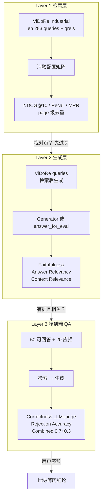
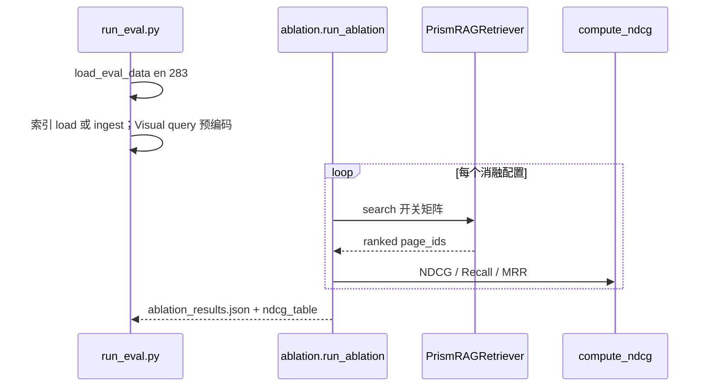
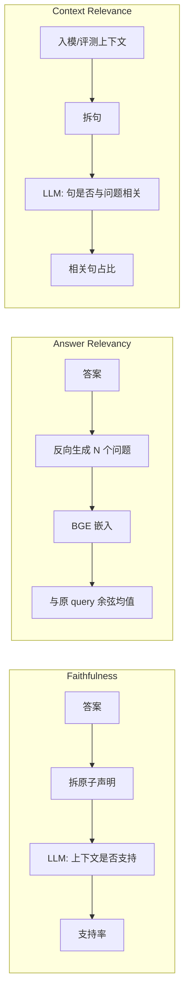
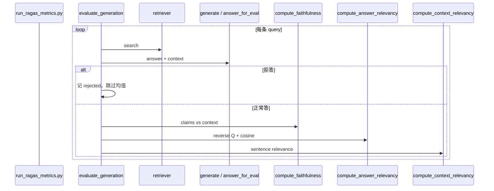
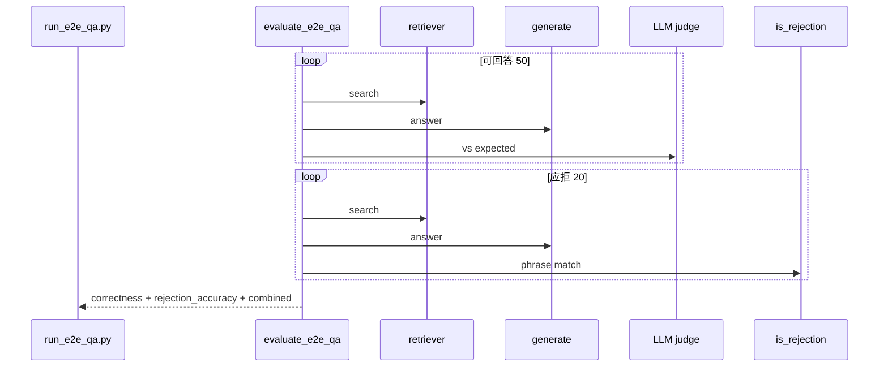
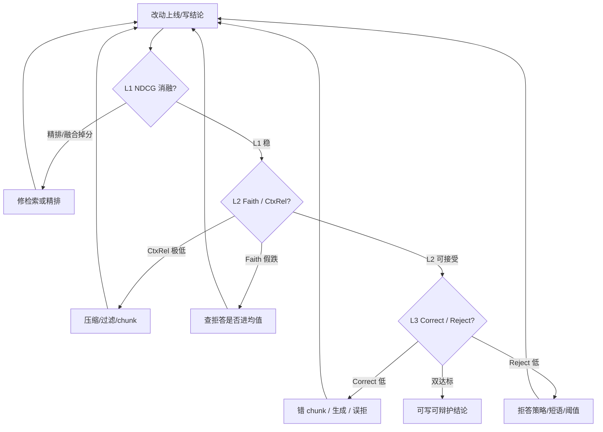

# Evaluation — 三层评测体系

> 状态：与当前实现对齐（`src/evaluation/`、`scripts/run_*.py`、协议 v1）  
> 更新：2026-07-22  
> 配套：  
> - 检索口径冻结：`docs/eval-protocol.md`（Boot-A / NDCG / 黄金消融）  
> - 数字与 run 归档：`runs/`、`handoff.md`（**本文不堆最新分**）  
> 本文偏 **评测架构、分层职责、口径纪律与代码入口**。

---

## 1. 一句话职责

用 **三层指标** 分别回答：

| 层 | 问题 | 不回答 |
|----|------|--------|
| **L1 检索** | 相关页有没有排上来？各模块贡献多少？ | 答案写得好不好 |
| **L2 生成** | 答案是否 grounded？是否答非所问？上下文噪音多大？ | 业务上「事实是否对」的绝对裁判 |
| **L3 端到端** | 用户问完，答对了吗？该拒时拒了吗？ | 细拆哪一路检索贡献 |

**原则：** 分层报数、修尺子先于堆模块、小样本冒烟 / 定稿全量，避免假 gap 带偏优化。

---

## 2. 边界

| 做 | 不做 |
|----|------|
| L1 消融 + page 级 NDCG/Recall/MRR | 与旧公式 NDCG（`1/(i+1)`）直接比绝对值 |
| L2 RAGAS 自实现（不绑 ragas 0.4 依赖链） | 线上实时 SLO 替代离线评测 |
| L3 可回答正确性 + 拒答准确率 | 单一「系统总分」掩盖分层问题 |
| 拒答统一检测、Faith 剔除拒答 | 把拒答当 Faith=0 进均值 |
| 协议 v1 / Boot 脚本可复现 | 本地 mac 全量 283q（见 Agents 限制） |

---

## 3. 分层总览



### 为何必须分层（瓶颈叙事）

```text
L1 NDCG 高  +  L2 CtxRel 低  →  页找对了，喂进 LLM 的句子仍脏
L1 低                         →  先修检索/精排，别先堆 Self-RAG
L3 Correct 低 + L1 已强       →  多半错 chunk / 压缩 / 生成，而非「没检到」
L3 Reject 高 + Faith 被拉低   →  先查口径：拒答是否进了 Faith 均值
```

历史诊断见 `docs/bottleneck-analysis-2026-07-07.md`（「找对了文件、喂错了内容」）。

---

## 4. Layer 1 — 检索层

### 4.1 职责与数据

| 项 | 值 |
|----|-----|
| 数据集 | `vidore/vidore_v3_industrial` |
| 语言 | **english only**（`--language en`） |
| 规模 | **283** query（全量；冒烟可用 `--max-queries 10`） |
| 相关标签 | qrels → `page_id` 集合 |
| 指标粒度 | **page 级**（同一 page 排名列表中仅首次计分） |

### 4.2 指标定义

| 指标 | 定义要点 |
|------|----------|
| **NDCG@10**（主指标） | 折扣 `1/log2(pos+2)`，与 pytrec_eval 一致；**page 首次出现** |
| NDCG@5 / Recall@5 / Recall@10 / MRR | 同去重规则 |
| avg_latency_ms | 该配置下每 query 检索墙钟均值 |

实现：`src/evaluation/ablation.py` → `compute_ndcg` / `compute_recall` / `compute_mrr`。

**禁止：** 与 2026-07-02 及更早 `1/(i+1)` 公式 run **直接比绝对 NDCG**。相对结论（如「精排是瓶颈」）须在协议 v1 下重验后沿用。

### 4.3 消融矩阵（归因工具）

全量配置 `ABLATION_CONFIGS`；Boot-A 默认 **`GOLDEN_NO_HYDE`**（无 HyDE，省 GPU）：

| name | bm25 | dense | visual | rerank | reranker |
|------|:----:|:-----:|:------:|:------:|----------|
| BM25_only | ✓ | | | | |
| Dense_only | | ✓ | | | |
| Visual_only | | | ✓ | | |
| BM25_Dense | ✓ | ✓ | | | |
| BM25_Dense_Visual | ✓ | ✓ | ✓ | | |
| Full_no_rerank | ✓ | ✓ | ✓ | | |
| Full_with_rerank | ✓ | ✓ | ✓ | ✓ | bge |
| Full_zerank2 | ✓ | ✓ | ✓ | ✓ | zerank |

可选（默认不跑）：`Full_*_HyDE`。

**黄金表必须回答：**

1. `Full_no_rerank` vs `Full_zerank2` → 精排是否主增益？  
2. `BM25_only` vs 融合无 rerank → 融合增量多大？  
3. 本 run 的 visual 模型 / table_summary / git SHA？

### 4.4 主路径



**编排纪律：** 融合/精排逻辑只在 `PrismRAGRetriever`，ablation **不复制**第二套管道；Visual 编码生命周期由 `run_eval.py` 分 Phase（防 OOM）。

### 4.5 入口

```bash
# 协议 v1 黄金消融（云上）
python scripts/run_eval.py --skip-index --language en --expected-query-count 283 \
  --visual-model colqwen2 --no-hyde \
  --output-dir runs/YYYYMMDD-bootA/golden-ablation

# 本地冒烟
python scripts/run_eval.py --max-queries 10 --skip-index --language en \
  --config-filter Full_zerank --visual-model colqwen2

bash scripts/cloud_boot_a.sh   # Boot-A 一键
```

细节冻结表：`docs/eval-protocol.md`。

---

## 5. Layer 2 — 生成层（RAGAS 自实现）

### 5.1 职责与数据

| 项 | 值 |
|----|-----|
| 查询源 | 通常同 ViDoRe en queries（可截断 50/100/150/283） |
| 管道 | 检索 top-k → 生成答案 → 多指标 Judge |
| Judge LLM | 默认 Ollama `qwen2:7b`（可配置） |
| 嵌入 | BGE（Answer Relevancy 反向问句相似度） |

**不依赖** `ragas` 包 0.4.x 依赖链；算法对齐 RAGAS 论文逻辑，实现在 `ragas_metrics.py`。

### 5.2 三项指标



| 指标 | 衡量 | 常见误读 |
|------|------|----------|
| **Faithfulness** | 答案声明有多少被 **context 支持** | 高 Faith ≠ 答案事实正确（context 错则 grounded 错） |
| **Answer Relevancy** | 答案是否 **答在问题上** | 与是否 grounded 无关 |
| **Context Relevance** | 检索/入模上下文有多少句 **真相关** | 历史短板；压缩/过滤主战场 |

### 5.3 拒答与均值口径（P0 纪律）

```text
is_rejection(answer) 或 阈值硬拒
  → rejected_count++
  → 该条 Faith / Rel **不进平均值**（excluded_from_avg）
  → 避免「多拒答 → Faith 假跌」
```

统一短语与检测：`src/rejection.py`（`ABSTAIN_ANSWER`、`REJECTION_PHRASES`、`is_rejection`）。  
Gate2 拒答句必须与此对齐，否则会再次污染 Faith。

### 5.4 与生产生成对齐

| 配置 | 作用 |
|------|------|
| `generation.eval_via_generator` | true：走 `answer_for_eval`（Generator ± Gate2），与 `/ask` 对齐 |
| false（默认） | 评测内 `generate_answer` 路径（历史/轻量） |

云上 Self-RAG A/B 应 **两臂均开** `eval_via_generator`，否则比的是两套生成器。

### 5.5 主路径



### 5.6 入口

```bash
python scripts/run_ragas_metrics.py --max-queries 10          # 冒烟
python scripts/run_ragas_metrics.py                           # 全量（云上）
# Boot-B 等：bash scripts/cloud_boot_b.sh
```

产出示例：`results/ragas_metrics_*.json`、`runs/.../ragas/`。

**采样注意：** Faith 等对样本量敏感（50/100 常高于 283）；定稿以大样本 + 固定协议为准。

---

## 6. Layer 3 — 端到端 QA

### 6.1 职责与数据

| 集 | 规模 | 文件 | 成功定义 |
|----|------|------|----------|
| **可回答** | 50 | `data/e2e_qa.json`（type=answerable） | LLM-as-judge：生成答案与 expected **语义等价** |
| **应拒** | 20 | 同文件 type=rejection 或 `data/rejection_qa.json` | `is_rejection(生成答案)` 为真 |

混合加载后共 **70** 条量级（50+20）。

### 6.2 指标

| 指标 | 定义 |
|------|------|
| **avg_correctness** | 可回答集上 judge YES 比例 |
| **rejection_accuracy** | 应拒集上正确拒答比例 |
| **combined_score** | `0.7 × Correct + 0.3 × RejectAcc`（缺一侧则权重归一） |
| rejected_count_answerable | 可回答却拒答的条数（误拒监控） |
| avg_latency | 端到端秒级 |

### 6.3 拒答：成功还是失败？（评测口径）

| 子集 | 拒答 | 计分 |
|------|------|------|
| 应拒集 | 拒了 | **成功**（抬 rejection_accuracy） |
| 应拒集 | 瞎答 | **失败** |
| 可回答集 | 拒了 | **失败**（Correctness NO / 误拒计数） |
| 可回答集 | 答对 | **成功** |

**不要**把拒答准确率与 Correctness 混成一个「系统正确率」讲故事。

### 6.4 Judge 规则摘要

- YES：与 expected 语义等价，允许措辞差  
- NO：矛盾、缺关键事实、**可回答却 cannot answer**  
- 生成要求 grounded；无信息则规范拒答句  

### 6.5 主路径



### 6.6 入口

```bash
python scripts/run_e2e_qa.py --max-queries 10
python scripts/run_e2e_qa.py --skip-index
# Self-RAG 对照可走 cloud_self_rag_ab.sh（与 L2 共用拒答口径）
```

---

## 7. 三层如何一起用（决策树）



| 优化方向 | 优先看 |
|----------|--------|
| 换 reranker / 融合 | L1 消融 Δ |
| 上下文压缩 / 表保护 | L2 CtxRel + Faith；L3 Correct |
| Self-RAG Gate2 | L2 Faith（剔拒答后）；L3 Reject / 延迟；**勿只报污染前后 Faith** |
| 删除一致性 | 增量 runbook + 同配置 NDCG 漂移，不是 L2 |

---

## 8. 口径纪律（防假 gap）

| 纪律 | 说明 |
|------|------|
| **协议 v1 NDCG** | log2 折扣 + page 去重；旧 run 只可作相对叙事 |
| **拒答统一** | `src.rejection` 全链路共用 |
| **Faith/Rel 剔拒答** | `excluded_from_avg` |
| **分层报数** | 检索增益 vs 精排增益分开；勿只报一个 Full 分 |
| **同索引复跑** | 漂移≈0 才谈「模块有效」 |
| **生成路径对齐** | 评 Gate2 开 `eval_via_generator` |
| **样本标注** | 50/100/283 写清；小样本偏高要披露 |
| **语言** | 正式 L1 用 en 283，勿混 all 语言 |

---

## 9. 关键代码与产物

| 路径 | 层 | 职责 |
|------|-----|------|
| `src/evaluation/ablation.py` | L1 | 配置矩阵、NDCG/Recall/MRR、run_ablation |
| `src/evaluation/vidore_adapter.py` | L1/共用 | 统一检索入口 |
| `src/evaluation/ragas_metrics.py` | L2 | Faith / Rel / CtxRel、批量评测 |
| `src/evaluation/e2e_qa.py` | L3 | Correctness / Rejection / combined |
| `src/evaluation/ragas_sanity.py` | L2 轻量 | sanity |
| `src/rejection.py` | L2/L3 | 拒答句与检测 |
| `scripts/run_eval.py` | L1 | 入口 + 显存编排 |
| `scripts/run_ragas_metrics.py` | L2 | 入口 |
| `scripts/run_e2e_qa.py` | L3 | 入口 |
| `scripts/cloud_boot_a.sh` | L1+增量 | 云上黄金消融 |
| `scripts/cloud_boot_b.sh` | L2 等 | 路由 + RAGAS |
| `scripts/cloud_self_rag_ab.sh` | L2/L3 | Gate2 对照 |
| `data/e2e_qa.json` | L3 | 50+20 |
| `data/rejection_qa.json` | L3 | 20 应拒 |
| `docs/eval-protocol.md` | L1 | 协议冻结 |
| `runs/YYYYMMDD-*/` | 全层 | 数字与 README 归档 |

### 观测接缝

评测可写 Trace / `record_ragas_score` 等（见 [trace.md](./trace.md)）；离线指标仍以 `runs/` JSON 为准。

---

## 10. 配置与开关

| 配置 | 影响层 | 说明 |
|------|--------|------|
| `--language en` / `--expected-query-count 283` | L1 | 协议校验 |
| `--no-hyde` / `--config-filter` | L1 | 黄金集 / 子集 |
| `--visual-model colqwen2` | L1 | 索引路径对齐 |
| `generation.eval_via_generator` | L2/L3 | 与生产 Generator 对齐 |
| `generation.self_rag.*` | L2/L3 | Gate2 开关与 trigger |
| `retrieval.rerank_score_reject_threshold` | L2 | 阈值硬拒（0=关） |
| `context_filter.mode` | L2/L3 | 入模上下文质量 |

---

## 11. 排障

| 现象 | 排查 |
|------|------|
| NDCG 和历史差一截 | 是否旧折扣公式？是否 en 283？是否同 visual 索引？ |
| Faith 一开 Gate 就掉 | 拒答是否进均值？是否统一 `is_rejection`？ |
| L1 高 L3 低 | 看 Trace context；错 chunk / 压缩；非「检索全挂」 |
| CtxRel 极低 | 预期过；优化压缩与 chunk，别只换 backbone |
| Judge 不稳 | temperature、重试、固定模型版本；对比要同机同模型 |
| 本地跑不动 | 全量上云；本地 `--max-queries 10` |

---

## 12. 已知限制

| 项 | 说明 |
|----|------|
| L2/L3 依赖 LLM judge | 有方差；定稿需固定模型与足够样本 |
| L3 集规模小 | 50+20，适合产品向，不替代 L1 283 |
| CtxRel 定义敏感 | 评最终入模 vs 原始检索 context 须写清 |
| 无线上 A/B 平台 | 当前为离线 run + 云脚本 |
| Combined 权重 0.7/0.3 | 启发式，汇报时建议分项也报 |

---

## 13. 30 秒口述（面试）

> 我们做三层评测，避免一个总分掩盖问题。  
> **第一层检索**：ViDoRe 英文 283 条，page 级 NDCG，黄金消融看精排和各路贡献。  
> **第二层生成**：自研 RAGAS 逻辑——Faith、答案相关、上下文相关；拒答不进 Faith 均值。  
> **第三层端到端**：50 条可回答 LLM 判对错，20 条应拒单独算准确率，综合 7:3 权重。  
> 优化时先看掉在哪一层；修评测口径和修模型同等重要。

**深读：** 检索数字协议 → `docs/eval-protocol.md`；内容入库 → [content-pipeline.md](./content-pipeline.md)；索引一致 → [ingestion.md](./ingestion.md)。
