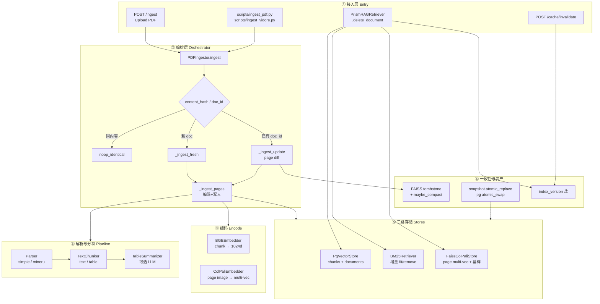
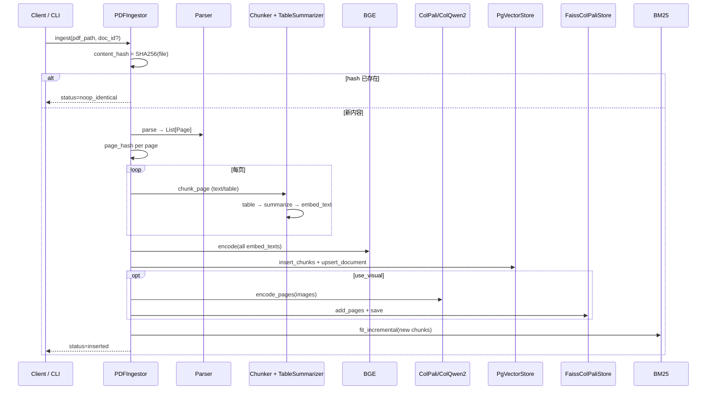
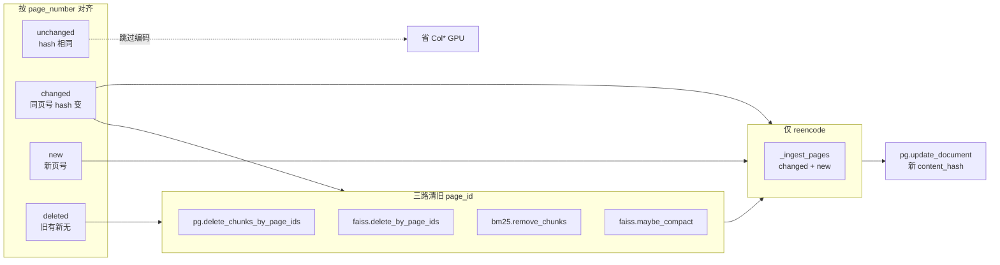
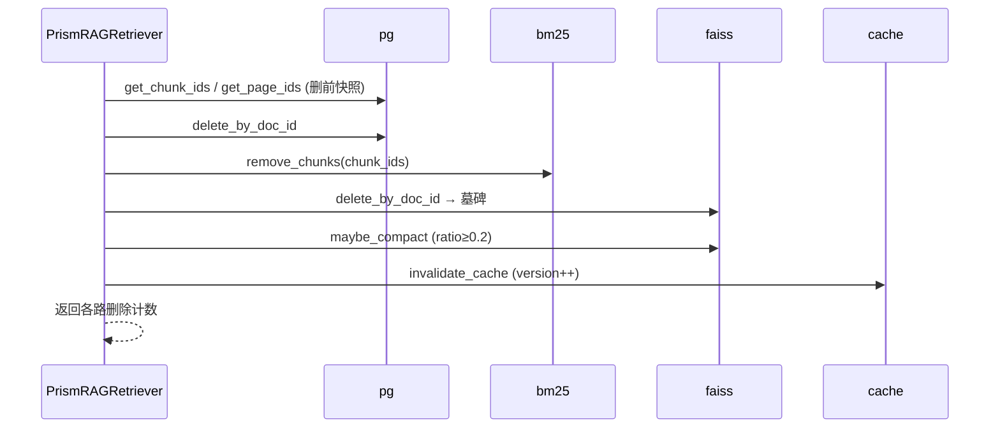
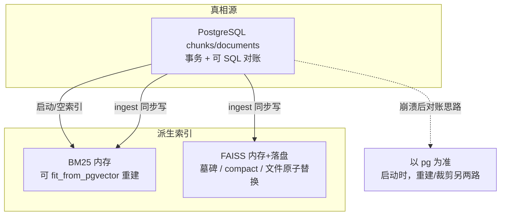

# Ingestion — 文档索引与增量更新

> 状态：与当前实现对齐（`src/ingestion/`、`src/store/`、`PrismRAGRetriever.delete_document`）  
> 更新：2026-07-22  
> 配套 Spec / 设计：  
> - `docs/incremental-update-optimization-spec-2026-07-16.md`（增量删除/更新总 Spec）  
> - `docs/incremental-update-delete-design-2026-07-09.md`（早期提案）  
> - `docs/incremental-verification-runbook.md`（云上验收）  
> - **解析 / 分块 / 表图入库细节**：[content-pipeline.md](./content-pipeline.md)  
> 本文偏 **索引生命周期与三路一致**；内容怎么切、表图怎么进库见 content-pipeline。

---

## 1. 一句话职责

把 **PDF（或 ViDoRe 页语料）** 变成可检索的三路索引资产：

| 路 | 粒度 | 存储 | 作用 |
|----|------|------|------|
| **Dense** | chunk | pgvector `chunks` | 语义向量检索 |
| **BM25** | chunk | 进程内倒排 | 关键词检索 |
| **Visual** | page | FAISS 多向量 | ColPali/ColQwen2 MaxSim |

并在 **同内容幂等、同 doc 页级 diff、删除三路一致、缓存版本盐失效** 上保证「改了知识库，答案跟得上」。

---

## 2. 边界

| 做 | 不做 |
|----|------|
| PDF 解析 → 分块 → BGE / Col* 编码 → 三路写入（切分细节见 [content-pipeline](./content-pipeline.md)） | 在线问答生成（属 Generation） |
| 内容哈希幂等 no-op | 跨租户 ACL / 文档级权限 |
| 同 `doc_id` 页级 hash diff 更新（省 GPU） | 分布式事务（三库强一致 2PC） |
| 三路删除编排 + FAISS 墓碑/compact | 完整 HTTP CRUD 产品（见 §8） |
| BM25 增量 fit / remove | 把 FAISS 换成 Milvus/Qdrant |
| pg 为真相源；大批量 snapshot 工具 | 查询期 L3/L4 缓存实现（见 [cache.md](./cache.md)） |

### 与其它模块的接缝

```text
Ingestion 写出 ──▶ pgvector / FAISS / BM25
                      │
                      ▼
              Retrieval 读入（三路 + RRF + Rerank）
                      │
语料变更 ──▶ invalidate_cache() ──▶ Cache index_version++
```

| 接缝 | 说明 |
|------|------|
| **Cache** | 删除必调 `invalidate_cache`；ingest 成功后 **当前 API 未自动 invalidate**（见 §9） |
| **Retrieval** | 启动时从 pg 冷启 BM25、load FAISS；Visual 命中页再反查 pg chunk |
| **Evaluation** | `ingest_vidore.py` 全量建基准索引；与业务 PDF ingest 共用 store |

---

## 3. 分层架构



### 层职责（一层一句）

| 层 | 职责 |
|----|------|
| ① 接入 | 收 PDF / 跑脚本 / 调删除；失败时清理半写入 |
| ② 编排 | 幂等 / 全新增 / 页 diff 三岔路；统一调 `_ingest_pages` |
| ③ 解析分块 | 页 markdown + 截图 → text/table chunk + 可选表摘要 |
| ④ 编码 | BGE 写 dense；Col* 写 visual（可 `use_visual=false` 跳过） |
| ⑤ 存储 | pg 真相源；FAISS 页向量；BM25 内存倒排 |
| ⑥ 一致性 | 墓碑压缩、原子文件/表切换、缓存版本盐 |

---

## 4. 核心对象

### 4.1 标识与哈希

| 对象 | 生成 | 含义 |
|------|------|------|
| `doc_id` | API：`uuid.hex[:12]`；脚本：可指定 / 随机 | 文档主键 |
| `page_id` | `random.getrandbits(31)` **每次写入新页新 id** | 页主键（Visual + chunk 关联） |
| `chunk_id` | chunker 规则 | 文本块主键 |
| `content_hash` | SHA256(整文件 bytes) | 文档级内容寻址 → 幂等 no-op |
| `page_hash` | SHA256(页面图 tobytes) 优先，否则 markdown | 页级 diff：未变页不重编码 |

### 4.2 pg 表（真相源）

```text
documents
  ├── doc_id PK
  ├── content_hash UNIQUE   ← 同文件 bytes 不再整篇重编
  └── source_path, created_at

chunks
  ├── chunk_id PK
  ├── page_id, doc_id, page_number
  ├── chunk_type: text | table
  ├── text, table_summary, doc_ref
  ├── bge_vector vector(1024)
  └── page_hash             ← 页 diff 判定
```

### 4.3 FAISS 内存结构

```text
FaissColPaliStore
  ├── _vectors / _page_ids / _page_boundaries   ← patch 级张量
  ├── _page_doc_ids: page_id → doc_id           ← 按文档删
  ├── _page_hashes:  page_id → page_hash
  └── _deleted_page_ids                         ← 墓碑（检索过滤）
```

检索时 `_rank_pages` **自动跳过墓碑页**；占比 ≥ 0.2 时 `maybe_compact` 物理重建。

### 4.4 BM25 内存结构

```text
BM25Retriever
  ├── fit_from_pgvector     ← 冷启动 / 空索引兜底
  ├── fit_incremental       ← 新 chunk 追加 + 重算 idf
  └── remove_chunks         ← 删 chunk，重建 postings
```

### 4.5 ingest 返回 status

| status | 含义 |
|--------|------|
| `noop_identical` | `content_hash` 已存在，0 页编码 |
| `inserted` | 全新文档全页写入 |
| `updated` | 同 `doc_id` 页 diff：返回 unchanged/changed/new/deleted 计数 |

---

## 5. 主路径时序

### 5.1 全新增（`_ingest_fresh`）



### 5.2 页级增量更新（`_ingest_update`）

**触发条件：** `document_exists(doc_id) == True`（同主键改版，不是「换文件新 uuid」）。



**要点：**

- unchanged：**三路都不动**（最大省 GPU 点）。  
- changed：旧 `page_id` 三路删掉 → 新 `page_id` 重编码写入。  
- deleted：只删不建。  
- 日志：`unchanged / changed / new / deleted` 计数可观测。

### 5.3 删除文档（`delete_document`）

**严格顺序**（先取 id 再删真相源，避免丢引用）：



| 历史缺陷 | 修复 |
|----------|------|
| **D2** 删后 BM25 仍召回进 RRF | `remove_chunks` 进编排 |
| **D1** FAISS 孤儿向量占候选 | 墓碑 + 检索过滤 |
| **D4** 先删 pg 丢 id | 删前先取 chunk_id/page_id |
| 缓存脏读 | `index_version` + clear L3/L4 |

### 5.4 三存储一致性模型



**模型：** 无分布式事务；采用 **pg 为真相源 + 同步编排 +（规划中）启动对账**。  
大批量刷新工具：`src/store/snapshot.py`（`atomic_replace` 文件、`atomic_swap_chunks` 表 RENAME）。

---

## 6. 关键代码

| 路径 | 职责 |
|------|------|
| `src/ingestion/pdf_ingestor.py` | **主编排**：幂等 / fresh / update / `_ingest_pages` |
| `src/ingestion/parser.py` | `SimplePDFParser` / `MinerUParser` → `Page` |
| `src/ingestion/text_chunker.py` | 清洗 + 分段；text/table chunk |
| `src/ingestion/table_summarizer.py` | 表摘要（入库 LLM，lru 去重） |
| `src/ingestion/encoders.py` | BGE / ColPali·ColQwen2 |
| `src/ingestion/vidore_ingestor.py` | 基准语料批量入库 |
| `src/store/pgvector_store.py` | schema、CRUD、page_hash、documents、swap |
| `src/store/faiss_store.py` | build/add/delete 墓碑/compact/save/load |
| `src/store/snapshot.py` | 原子文件替换 + pg swap SQL |
| `src/retrieval/bm25_retriever.py` | fit / fit_incremental / remove_chunks |
| `src/evaluation/vidore_adapter.py` | `delete_document` / `invalidate_cache` |
| `src/api/routes.py` | `POST /ingest`；失败回滚 pg + 上传文件 |
| `scripts/ingest_pdf.py` / `ingest_vidore.py` | CLI 入口 |
| `tests/test_p2_incremental.py` | 增量 / page diff / 快照单测 |
| `tests/test_lifecycle.py` | 删除生命周期 |

---

## 7. 配置与开关

| 配置 | 典型位置 | 作用 |
|------|----------|------|
| `ingestion.parser` | `models.local-dev.yaml`: `simple` | `simple` PyMuPDF；`mineru` 生产解析 |
| `ingestion.table_summary_enabled` | 默认 True（代码 get） | 表是否走 LLM 摘要再 embed |
| `retrieval.use_visual` | local-dev 可 false | false 时跳过 Col* 与 FAISS 写入 |
| `storage.pgvector.*` | `models.yaml` | PG 连接 |
| `storage.faiss.index_path` 等 | `models.yaml` | FAISS 落盘路径 / flat\|hnsw |
| `embedding.colpali_batch_size` | `models.yaml` | 视觉编码 batch |

**API 行为注意：**

```text
POST /ingest
  → 总是新生成 doc_id = uuid.hex[:12]
  → 同文件再传：content_hash 命中 → noop_identical（不重编）
  → 不会走「同 doc_id 页 diff」——改版更新需脚本/调用方传入已有 doc_id
```

---

## 8. 排障 / 运维入口

| 现象 | 排查 |
|------|------|
| 删了文档答案里还有旧内容 | 是否走完整 `delete_document`？仅删 pg 会 **D2 幽灵**；查 BM25 / FAISS 墓碑 |
| Visual 仍命中已删页 | 查 `_deleted_page_ids` 是否写入；旧索引无 `_page_doc_ids` 映射会告警跳过删 |
| 小改 PDF 却全页重编码 | 是否同 `doc_id`？API 新 uuid 永远全量 insert；hash 是否图级稳定 |
| 同文件重复上传仍很慢 | 看返回是否 `noop_identical`；`documents.content_hash` 是否写入 |
| 入库后问答仍像旧库 | L3/L4 未失效：调 `POST /cache/invalidate` 或重启；**ingest 后建议显式 invalidate**（§9） |
| ingest 500 | API 会 `delete_by_doc_id` + 删上传文件 + mineru 输出目录 |
| PG 锁 / 迁移卡住 | store 使用 `autocommit=True` 防 idle-in-transaction；见 `pgvector_store` 注释 |
| 云上验收 | `docs/incremental-verification-runbook.md` |

### 运维命令印象

```bash
# 业务 PDF（需 PG + 模型）
python scripts/ingest_pdf.py path/to/file.pdf

# 基准语料
python scripts/ingest_vidore.py --max-pages 10

# 删除（代码/评测侧；HTTP DELETE 端点当前未挂）
# retriever.delete_document(doc_id)

# 强制缓存失效
curl -X POST http://localhost:8000/cache/invalidate
```

---

## 9. 已知限制与演进

| 项 | 现状 | 演进 |
|----|------|------|
| HTTP 删除 | 无 `DELETE /documents/{id}`；编排在 `delete_document` | 产品化补端点 + 鉴权 |
| ingest 后缓存 | **未**自动 `invalidate_cache` | 成功路径补 version++（与 delete 对齐） |
| API 页 diff | 每次新 `doc_id`，页 diff 主要给同 id 程序调用 | `/ingest?doc_id=` 或 update 专用接口 |
| BM25 进程内 | 多 worker 不共享；重启靠 `fit_from_pgvector` | 持久化或启动对账 |
| FAISS 墓碑 | 检索正确，物理空间靠 compact≥20% | 异步 compact / 写盘后 reload |
| 崩溃半写入 | 失败路径尽量回滚 pg；FAISS/BM25 非事务 | deletion ledger / 启动 reconcile（Spec） |
| 跨存储 2PC | 不做 | 终态一致 + 对账 |
| ViDoRe vs 业务 | 两套 ingestor，共享 store | 保持；避免评测索引与业务库混载 |

### 已修复缺陷速查（面试可用）

| ID | 问题 | 修复落点 |
|----|------|----------|
| D2 | 删文档 BM25 幽灵召回污染答案 | 三路编排 `remove_chunks` |
| D1 | FAISS 无删占候选/显存 | 墓碑 + `delete_by_doc_id` |
| U1 | BM25 每次全量 rebuild | `fit_incremental` |
| U2 | 同内容重入库副本 | `content_hash` 幂等 |
| P2-B | 小改全书重编烧 GPU | `page_hash` diff |

---

## 10. 20 秒口述（面试）

> 入库是 Parser → 分块 → BGE 进 pgvector、Col 进 FAISS、BM25 增量 fit。  
> 同文件 content_hash 直接 no-op；同文档改版按 page_hash 只重编码变页。  
> 删除严格 pg → BM25 → FAISS 墓碑，再 bump `index_version` 清缓存，避免幽灵召回和脏缓存。  
> pg 是真相源，另两路是派生索引，靠编排和可重建保证一致，不做分布式事务。

**深读：** Spec `docs/incremental-update-optimization-spec-2026-07-16.md`；缓存接缝 [cache.md](./cache.md)。
