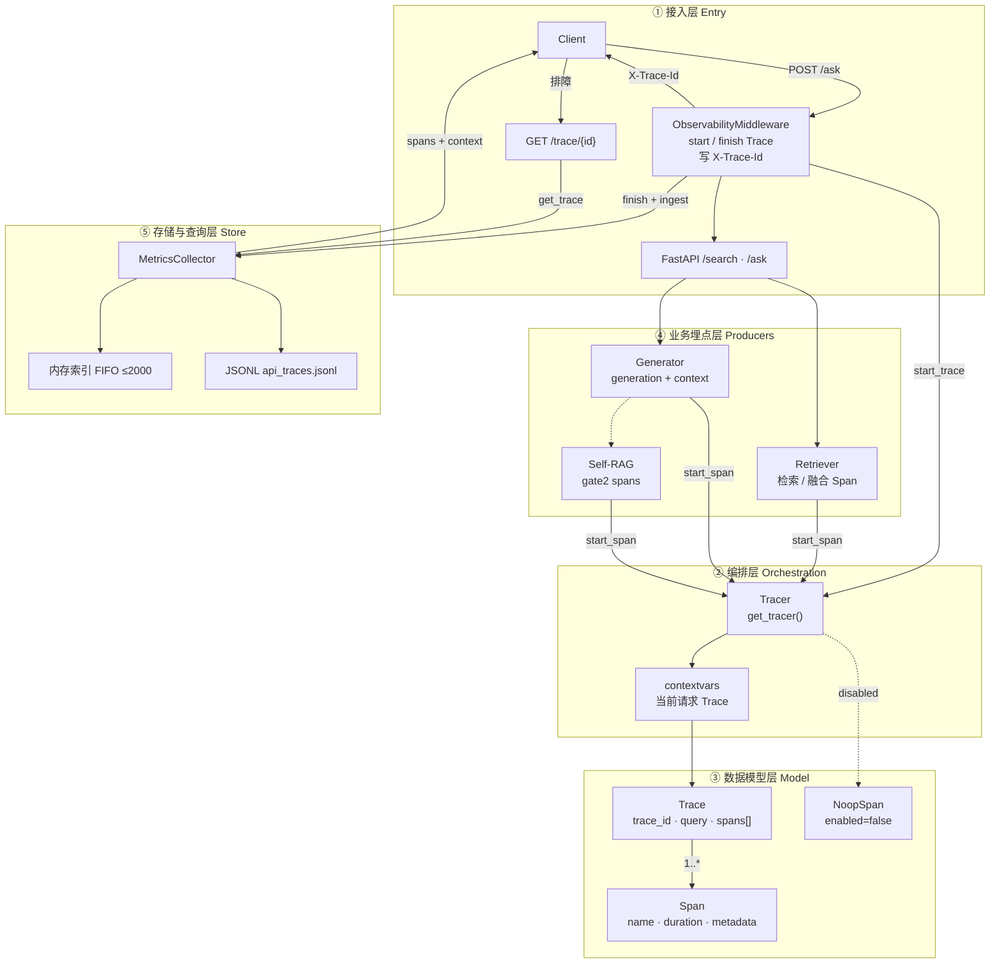
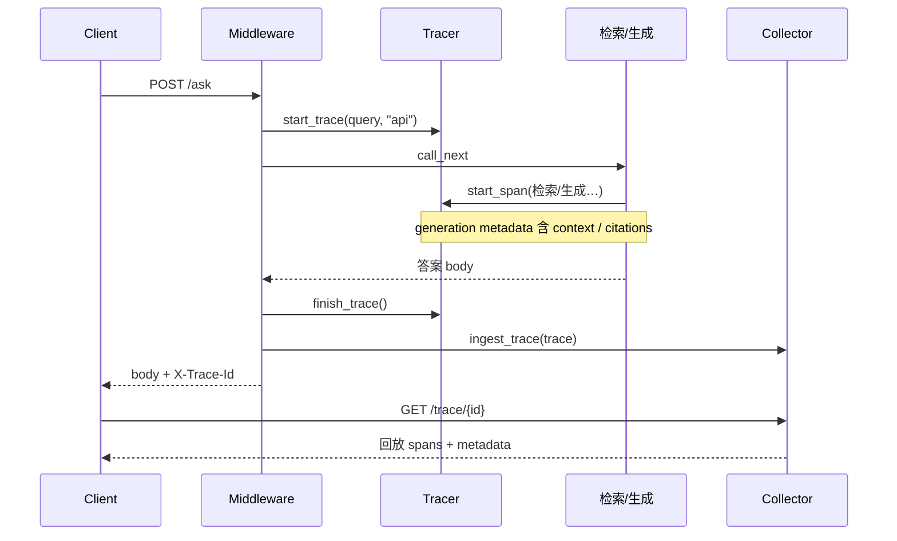

# Trace — 请求级可观测链路

> 状态：与当前实现对齐（`src/observability/`）  
> 更新：2026-07-21

---

## 1. 一句话职责

为**每一次**检索/问答请求建立可回放的时间线：步骤耗时 + 关键 metadata（尤其是生成侧入模 `context`），并通过 `X-Trace-Id` 反查，区分 **检索错** 还是 **生成错**。

---

## 2. 边界

| 做 | 不做 |
|----|------|
| 请求级 Trace + 步骤 Span | 跨服务分布式追踪（OTel/Jaeger 全套） |
| contextvars 隔离当前请求 | 把 `trace_id` 当业务参数层层传递 |
| 内存索引 + JSONL 持久化 | 无限保留、集群级日志平台 |
| 生成 Span 挂 context/citations | 替代 body 里的业务 `retrieval_trace` |

### 两个易混概念

| 名称 | 含义 | 入口 |
|------|------|------|
| **Observability Trace** | `Trace` + `Span[]`（计时 + metadata） | 响应头 `X-Trace-Id` → `GET /trace/{id}` |
| **retrieval_trace** | 各路 Top-K 业务载荷 | `/search`、`/ask` 响应 body |

排障「入模有没有证据」看 **Observability Trace** 的 `generation` span metadata。

---

## 3. 分层架构



### 层职责（一层一句）

| 层 | 职责 |
|----|------|
| ① 接入 | 开单、合单、写订单号；提供查单 API |
| ② 编排 | Tracer + contextvars：总单放在当前请求上下文 |
| ③ 模型 | Trace = 总单；Span = 步骤（metadata 可挂 context） |
| ④ 埋点 | 检索/生成/Gate 只负责 `start_span` |
| ⑤ 存储 | Collector 入库（内存 + JSONL）并支持按 id 反查 |

---

## 4. 数据结构（树状）

### 4.1 运行时对象关系

```text
Tracer                          # 全局单例 get_tracer()
├── enabled: bool
├── ContextVar → Trace | None   # 当前请求「抽屉」
│
└── Trace                       # 一次 query 的总单
    ├── trace_id: str           # 16 hex → 即 X-Trace-Id
    ├── query: str
    ├── config_label: str       # API 为 "api"；评测为配置名
    ├── started_at: datetime
    ├── finished_at: datetime | None
    ├── duration_ms: float
    └── spans: list[Span]       # 扁平列表（非嵌套树）
        │
        ├── [0] Span            # 例: retrieval / fusion_rerank
        │   ├── name: str
        │   ├── span_id: str            # 12 hex
        │   ├── parent_span_id: str     # *实际 = Trace.trace_id
        │   ├── started_at / finished_at
        │   ├── duration_ms: float
        │   ├── status: "ok" | "error"
        │   └── metadata: dict          # 步骤私有载荷
        │       └── (随 name 而异，见 4.3)
        │
        ├── [1] Span            # 例: generation
        │   └── metadata
        │       ├── model / k_context / prompt_id
        │       ├── context: str        # ★ 入模上下文（排障关键）
        │       ├── citations: list
        │       └── num_citations / num_retrieved
        │
        └── [n] Span            # 例: self_rag.gate2 …
            └── metadata
                └── attempts / gate_degraded / …

NoopSpan                        # enabled=false 时的占位（字段空操作）
├── name / span_id="" / duration_ms=0
├── metadata: {}
└── status: "ok"
```

\* `parent_span_id` **不是**父 Span 的 id，而是挂到 Trace 上的扁平挂载。

### 4.2 序列化形态（`Trace.to_dict()` / JSONL / `GET /trace/{id}`）

```text
{
  trace_id
  query
  config_label
  started_at                    # ISO 字符串
  finished_at
  duration_ms
  spans[]
  ├── span_id
  ├── parent_span_id
  ├── name
  ├── started_at
  ├── finished_at
  ├── duration_ms
  ├── status
  └── metadata                  # 原样 dict，不固定 schema
}
```

### 4.3 常见 Span.metadata 形状（按 name）

```text
metadata  (dict，约定而非强类型)
├── 检索类 (bm25_search / dense_search / visual_search / fusion_rerank / …)
│   └── num_results: float|int    # Collector 会用来聚合 hits
│
├── hyde_generate
│   └── cache_hit: bool
│
├── generation
│   ├── model: str
│   ├── k_context: int
│   ├── prompt_id: str
│   ├── context: str              # ★ 二分检索/生成
│   ├── citations: list
│   ├── num_citations: int
│   └── num_retrieved: int
│
└── self_rag.gate2 / attempt.*
    ├── action / final_action
    ├── gate_degraded: bool
    ├── error?: str
    └── …（attempts_detail 等，实现以 self_rag 为准）
```

### 4.4 Collector 侧存储树

```text
MetricsCollector
├── _traces: list[trace_dict]           # 评测 snapshot 用
├── _trace_by_id: dict[id → trace_dict] # 在线反查
├── _trace_id_order: list[id]           # FIFO，cap=2000
├── _trace_log_path → JSONL 文件        # 每行一个 trace_dict
├── _latencies[config_label]: [ms, …]
├── _hit_data[config_label][bm25|dense|…]: […]
├── _cache_data[config_label][layer]: {hits, misses}
├── _ragas_scores / _ragas_details
└── _alerts: list[AlertEvent]
```

### 4.5 业务侧 retrieval_trace（响应 body，≠ Observability Trace）

```text
SearchResponse / AskResponse 中的 retrieval_trace
├── bm25_top5:   [ RouteTraceItem, … ]   # 最多展示 Top-5
├── dense_top5:  [ RouteTraceItem, … ]
└── visual_top5: [ RouteTraceItem, … ]
    │
    RouteTraceItem
    ├── chunk_id: str
    ├── page_id: int
    └── score: float
```

### 4.6 对象要点速查

| 对象 | 要点 |
|------|------|
| `Trace` | 一次请求总单；`spans[]` 扁平 |
| `Span` | 一步；`metadata` 才是排障载荷 |
| `Tracer` | 开单/贴条/合单；关则 Noop |
| `MetricsCollector` | 收单、索引、JSONL、聚合 |
| `RetrievalTrace` | 仅 body 内各路 Top-K，另一棵树 |

---

## 5. 主路径时序（`/ask`）



### 排障二分（唯一核心用法）

打开 Trace → 看 `generation` span 的 `metadata.context`：

| context 中是否含证据 | 判断 |
|----------------------|------|
| 无 | 检索 / 分块 / 路由问题 |
| 有 | 生成 / 压缩 / 幻觉 / 应拒未拒 |

---

## 6. 关键代码

| 路径 | 角色 |
|------|------|
| `src/observability/tracer.py` | Trace / Span / NoopSpan / Tracer / contextvars |
| `src/observability/middleware.py` | HTTP 生命周期 + `X-Trace-Id` + ingest |
| `src/observability/collectors.py` | 索引、JSONL、`get_trace`、指标 |
| `src/api/routes.py` | `GET /trace/{id}`；`/search` `/ask` 挂载中间件 |
| `src/generation/generator.py` | `generation` span + context metadata |
| `src/generation/self_rag.py` | Gate2 相关 span |
| `src/evaluation/vidore_adapter.py` | 检索路径 span；评测可自管 start/finish |

评测 CLI **无 Middleware** 时，由脚本自行 `start_trace` / `finish_trace` / `ingest_trace`。

---

## 7. 配置与开关

| 配置 | 含义 | 默认倾向 |
|------|------|----------|
| `observability.trace_enabled` | 总开关；false 则 NoopSpan | 开（以 YAML 为准） |
| `observability.trace_persist_path` | JSONL 路径；空则只内存 | `logs/api_traces.jsonl` |
| 内存反查上限 | FIFO | 2000 条 |

---

## 8. 排障 / 运维入口

1. 从响应头取 `X-Trace-Id`  
2. `GET /trace/{trace_id}`  
3. 优先看 `generation`（及 Self-RAG attempts）的 metadata  
4. 进程重启或超过 FIFO：依赖 JSONL 回扫（`get_trace` 已实现回退）

持久化失败**不影响**主请求（Collector 吞异常）。

---

## 9. 已知限制与演进

| 限制 | 说明 |
|------|------|
| 非 OTel | 无 W3C 传播、无标准导出 |
| 扁平 Span | 无严格父子嵌套树 |
| 单实例导向 | 多副本需集中日志/共享存储才可全局查 |
| body 预读 | Middleware 对 `/search` `/ask` 解析 query 时读取 body，需与框架 body 消费方式一致 |

可选演进：OTel 导出、采样、脱敏、与 `retrieval_trace` 在查单接口中合并视图。

---

## 10. 口述 20 秒

> 每次问答开一张 Trace，步骤用 Span 记账，生成 Span 带着入模 context。  
> 订单号在 `X-Trace-Id`。答错用 id 回放 context，二分检索还是生成。  
