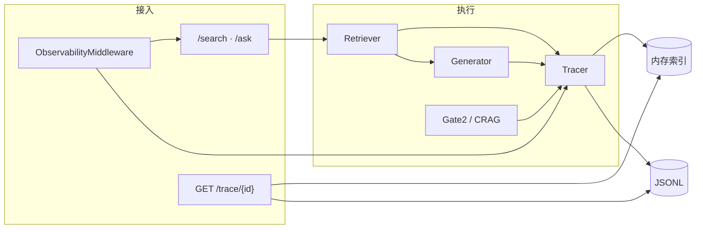
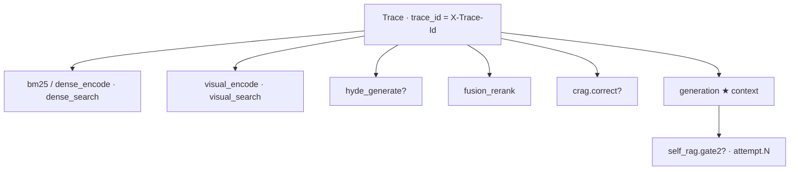
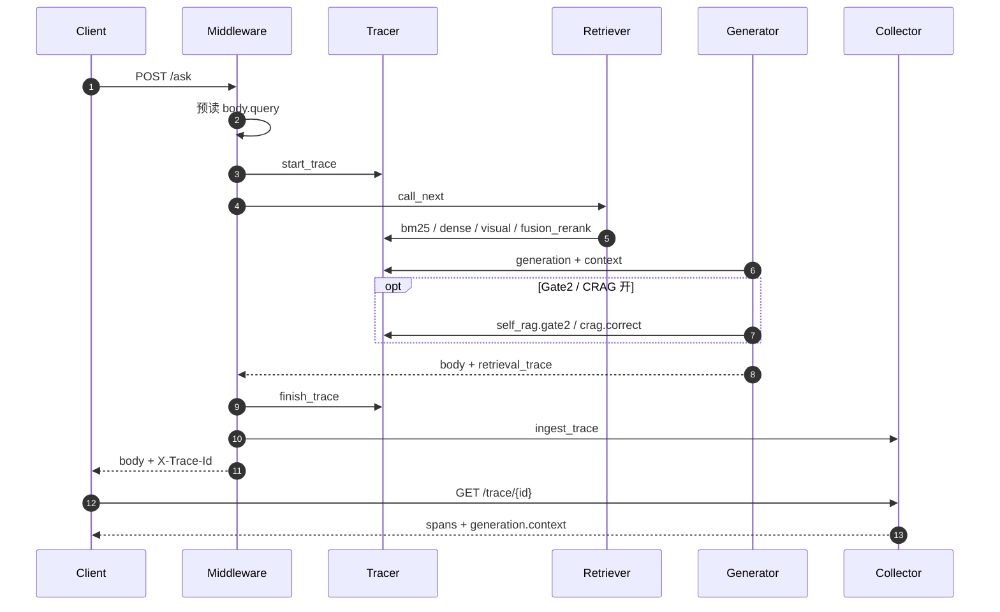

# Trace — 请求级可观测链路

| 项 | 内容 |
|----|------|
| 文档 | `docs/architecture/trace.md` |
| 状态 | 与当前实现对齐（`src/observability/`） |
| 日期 | 2026-08-15 |
| 范围 | 一次 `/ask`·`/search`·评测 query 的因果时间线：分层与 ID、规范 Span 名、必记 metadata、存储 / 反查、与 `retrieval_trace` / Cache / 评测的边界 |
| 关联 | [`evaluation.md`](./evaluation.md) 失败归因看 generation.context；[`cache.md`](./cache.md) 缓存命中进 Collector 不进 Span 树；[`ingestion.md`](./ingestion.md) 入库无请求 Trace |
| 仓形态 | 单进程 FastAPI + 评测 CLI。观测失败 **不得** 阻断主路径 |

---

## 1. 一句话

Trace 是横切 **观测面**，不是检索权威，也不替代响应 body 里的业务 `retrieval_trace`。

每一次问答 / 检索一张因果单：`trace_id`（16 hex）= 响应头 `X-Trace-Id`。步骤用 **Span** 记墙钟和 metadata；排障看 `generation` span 里的入模 `context`，二分 **检索错 vs 生成错**。

```text
Client
    POST /ask · /search
    响应头 X-Trace-Id
    GET /trace/{id}
FastAPI（中间件开单 / 合单）
    Retriever · Generator · Gate2 / CRAG
Trace（横切）
    Trace = 一次请求    Span = 一步墙钟 + metadata
    内存 FIFO ≤2000  +  JSONL 持久化
```

**不做什么：** 不替代 body 里各路 Top-K；不做跨服务 OTel/Jaeger；不把 `trace_id` 当业务参数层层传递（靠 contextvars）；不无限期、不跨副本共享；默认不做脱敏 / 采样 / 独立 payload 桶。

---

## 2. 在系统里的位置


```mermaid
flowchart LR
    subgraph C["接入"]
        MW[ObservabilityMiddleware]
        API["/search · /ask"]
        Lookup["GET /trace/{id}"]
    end
    subgraph P["执行"]
        Ret[Retriever]
        Gen[Generator]
        Opt[Gate2 / CRAG]
        Tr[Tracer]
        Ret --> Tr
        Gen --> Tr
        Opt --> Tr
    end
    MW --> Tr
    MW --> API
    API --> Ret --> Gen
    Tr --> Mem[(内存索引)]
    Tr --> Disk[(JSONL)]
    Lookup --> Mem
    Lookup --> Disk
```

| 面 | 负责 | 不负责 |
|----|------|--------|
| Middleware | HTTP 开单 / 合单 / 写 `X-Trace-Id` / ingest | 不埋业务步骤 |
| Tracer | contextvars 当前 Trace；`start_span` | 不裁决能否检索 / 生成 |
| 检索 / 生成 | 只负责 `start_span` + metadata | 不自己写盘 |
| Collector | 入库、FIFO、JSONL、`get_trace`、延迟/命中聚合 | 不是看板权威 |
| 响应 body `retrieval_trace` | 各路 Top-5 chunk 业务载荷 | 不含入模 context |

评测 CLI **无 Middleware**：脚本自行 `start_trace` / `finish_trace` / `ingest_trace`。入库路径（`/ingest`）不开问答 Trace。

---

## 3. 分层：Trace / Span / Log

对齐 OpenTelemetry 精神，本仓只有两级运行对象（无独立漏斗 Event）。

| 层级 | 本项目定义 | 生命周期 | 典型 |
|------|------------|----------|------|
| **Trace** | 一次 query 的完整时间线；根 ID = `trace_id` | Middleware `start` → `finish` | 整次 `/ask` |
| **Span** | 有起止的一步；**扁平**挂在 Trace 上 | `start_span` → `__exit__` | `bm25_search` / `generation` |
| **Log** | 人类可读诊断 | 任意 | 异常栈；**不作排障权威** |


```mermaid
flowchart TB
    T["Trace · trace_id = X-Trace-Id"]
    S1["bm25 / dense_encode · dense_search"]
    S2["visual_encode · visual_search"]
    S3["hyde_generate?"]
    S4["fusion_rerank"]
    S5["crag.correct?"]
    S6["generation ★ context"]
    S7["self_rag.gate2? · attempt.N"]

    T --> S1
    T --> S2
    T --> S3
    T --> S4
    T --> S5
    T --> S6
    S6 --> S7
```

| 原则 | 说明 |
|------|------|
| 排障优先读 Span metadata | 尤其 `generation.context` / `citations` |
| Span 扁平 | `parent_span_id` **实际 = `trace_id`**，不是父 Span |
| 关总开关 | 全部 `NoopSpan`，零开销 |
| Log 不可替代 Trace | 不要靠散落 print 回放入模上下文 |

本仓 **没有**「漏斗 Event + 单一 authority」（那是托管 Agent 仓的模型）。失败归因用分层评测 + 本 Trace 的 context 二分，见 [`evaluation.md`](./evaluation.md)。

---

## 4. ID 体系

| ID | 生成方 | 粒度 | 传播 | 说明 |
|----|--------|------|------|------|
| `trace_id` | Tracer / `uuid4().hex[:16]` | **一次 HTTP 或一次评测 query** | 响应头 `X-Trace-Id`；`GET /trace/{id}` | 存储与传输都是裸 hex，无 `tr_` 前缀 |
| `span_id` | Span / `uuid4().hex[:12]` | 每个步骤 | 仅 Trace 内 | |
| `parent_span_id` | `start_span` | 挂到 Trace | 序列化字段 | **= `trace_id`**，不是嵌套父 span |
| `config_label` | 开单方 | 一次 Trace | JSONL / 聚合键 | API = `"api"`；评测 = 消融配置名 |
| `query` | Middleware 预读 body，或评测脚本 | 该次问题 | Trace 字段 | `/search` `/ask` 才解析；失败则 `"(API request)"` |

```text
trace_id
 ├── span: bm25_search
 ├── span: dense_encode / dense_search
 ├── span: visual_encode / visual_search
 ├── span: hyde_generate          # 可选
 ├── span: fusion_rerank
 ├── span: crag.correct           # 可选，默认关
 ├── span: generation             # metadata.context = 入模全文
 └── span: self_rag.gate2         # 可选
      └── span: self_rag.gate2.attempt.N
```

无 `conversation_id` / `agent_session_id`。二次请求 = 新 `trace_id`。L3/L4 缓存命中仍会走 Middleware 开单，但检索 / 生成 Span 可能更少（旁路跳过真计算）。

---

## 5. 规范 Span 名

导出 JSON 的 `name` 必须是下表实现名。展示可用中文 label，禁止再发明同义主名。

### 5.1 在线检索 / 生成（主路径）

| Canonical | 谁埋 | 要点 |
|-----------|------|------|
| `bm25_search` | `BM25Retriever.search` | `num_results` → Collector 聚命中 |
| `dense_encode` | `DenseRetriever.search` | 编码耗时 |
| `dense_search` | 同上 | `num_results` |
| `visual_encode` | `VisualRetriever.search` | 预编码路径可无此 span |
| `visual_search` | `search` / `search_with_embedding` | `num_pages` / `num_results` / `pre_encoded` |
| `hyde_generate` | HyDE | `cache_hit` |
| `fusion_rerank` | `vidore_adapter` | 输入/输出条数、rerank 分统计 |
| `generation` | `Generator.answer` | **★ `context` / `citations` / `refiner`** |
| `crag.correct` | CRAG（默认关） | enabled / grade 参数；失败 pass-through |
| `self_rag.gate2` | Gate2（默认关） | trigger / attempts_detail / final_action |
| `self_rag.gate2.attempt.{n}` | Gate2 每轮 | `attempt` / `prompt_id` |

### 5.2 评测 / 适配器

| Canonical | 谁埋 | 要点 |
|-----------|------|------|
| `retrieval` | `vidore_adapter` / RAGAS 评测包一层 | 评测脚本自管开单时的检索外包 |
| `e2e_qa_answerable` / `e2e_qa_rejection` | `e2e_qa.py` | L3 评测臂 |
| `ragas_faithfulness` 等 | `ragas_metrics.py` | 生成层尺子，非正式线上排障 |

Collector 用名字聚 hits 的映射（改名会断聚合）：

```text
bm25_search → bm25
dense_search → dense
visual_search → visual
fusion_rerank → fused
rerank → reranked   # 历史别名，主路径现用 fusion_rerank
```

---

## 6. 必记内容

### 6.1 生命周期（100%）

| 时机 | 记录 |
|------|------|
| 请求进入 `/search` `/ask` | `start_trace(query, config_label="api")` |
| 响应返回 | `finish_trace` → 写 `X-Trace-Id` → `ingest_trace` |
| Trace 关闭或禁用 | 无 header / 无入库 |

### 6.2 `generation`（排障核心）

```text
model, k_context, prompt_id,
num_retrieved, num_citations,
citations[{chunk_id, page_id, doc_id, page_number, snippet}],
context,                # ★ 完整入模字符串
refiner                 # soft_rank / bge 等压缩痕迹
```

空检索：`context=""`，`citations=[]`，答案走统一拒答句——Trace 仍在。

### 6.3 检索类

各路 `num_results`（或 visual 的 `num_pages`）。**各路 Top-K 文本不进 Observability Span**，在 body `retrieval_trace`。

### 6.4 可选旁路

Gate2：`attempts_detail`（每轮 score / action）。CRAG：是否 applied、失败原因。默认关时线上常无这些 span。

---

## 7. 与 retrieval_trace / 评测 / 缓存

| 概念 | 含义 | 入口 |
|------|------|------|
| **Observability Trace** | `Trace` + `Span[]`（计时 + metadata） | `X-Trace-Id` → `GET /trace/{id}` |
| **retrieval_trace** | 各路 Top-5 `chunk_id / page_id / score` | `/search` `/ask` **body** |
| **评测 config_label** | 消融臂名，便于按配置聚合延迟 | `run_eval` 等自管开单 |
| **Cache 命中** | `record_cache_event(retrieval\|answer)` | Collector 计数，**不是** Span 名 |

```text
答错
 ├─ GET /trace → generation.context 无证据 → 检索 / 分块 / 路由 / 压缩砍光
 ├─ context 有证据仍胡写 → 生成 / 幻觉 / 应拒未拒
 └─ 只需看「各路召回了谁」→ body.retrieval_trace（不必开 Trace）
```

缓存 key 含 `index_version`，与 `trace_id` 无关。命中 L4 时可能几乎没有检索 Span，仍有 Middleware 总单。

---

## 8. 怎么记

### 8.1 逻辑模型

```text
Tracer                          # get_tracer() 进程单例
├── enabled
└── ContextVar → Trace | None

Trace
├── trace_id, query, config_label
├── started_at / finished_at / duration_ms
└── spans[]                     # 扁平
      Span
      ├── name, span_id, parent_span_id(=trace_id)
      ├── duration_ms, status=ok|error
      └── metadata: dict        # 约定而非强 schema
```

`Trace.to_dict()` = JSONL 一行 = `GET /trace/{id}` 响应。

### 8.2 Tracer 契约

```text
start_trace(query, config_label)  → ContextVar 放入当前 Trace
start_span(name, metadata?)       → context manager；__exit__ finish；异常 mark_error
finish_trace()                    → 弹出 ContextVar，返回已 finish 的 Trace
enabled=false                     → NoopSpan，字段空操作
```

业务异常 **不**被 Tracer 吞掉。无当前 Trace 时仍创建 Span，但不挂到任何总单（等于丢）。

### 8.3 存储

| 层 | 介质 | 内容 | 保留 |
|----|------|------|------|
| 内存索引 | `MetricsCollector._trace_by_id` | 完整 trace dict | FIFO **2000** |
| 磁盘 | `observability.trace_persist_path` | 每行一条 JSON | 进程外文件；空路径 = 关 |
| 聚合 | 同 Collector | 延迟、各路 hits、cache、RAGAS | 评测 snapshot |

`get_trace`：先内存，未命中再 **顺序扫 JSONL**（重启 / FIFO 淘汰）。持久化异常 **吞掉**，不影响主请求。

无 Kafka / 独立 payload 桶 / legal_hold。完整 `context` 直接躺在 JSONL 里——本地排障够用，**不要当多租户审计仓**。

### 8.4 配置

| 配置 | 含义 | 默认 |
|------|------|------|
| `observability.trace_enabled` | 总开关 | `true` |
| `observability.trace_persist_path` | JSONL；空串只内存 | `logs/api_traces.jsonl` |

---

## 9. 何时记

### 9.1 主路径 `/ask`


```mermaid
sequenceDiagram
    autonumber
    participant C as Client
    participant M as Middleware
    participant T as Tracer
    participant R as Retriever
    participant G as Generator
    participant K as Collector

    C->>M: POST /ask
    M->>M: 预读 body.query
    M->>T: start_trace
    M->>R: call_next
    R->>T: bm25 / dense / visual / fusion_rerank
    G->>T: generation + context
    opt Gate2 / CRAG 开
        G->>T: self_rag.gate2 / crag.correct
    end
    G-->>M: body + retrieval_trace
    M->>T: finish_trace
    M->>K: ingest_trace
    M-->>C: body + X-Trace-Id
    C->>K: GET /trace/{id}
    K-->>C: spans + generation.context
```

### 9.2 挂点表

| 挂点 | 记录 |
|------|------|
| Middleware 入 | `start_trace` |
| BM25 / Dense / Visual | 各路 encode/search span |
| HyDE | `hyde_generate` |
| RRF + 精排 | `fusion_rerank` |
| CRAG | `crag.correct`（默认关） |
| 生成 | `generation`（空检索也记） |
| Gate2 | `self_rag.gate2` + attempt |
| Middleware 出 | `finish` + header + ingest |
| 排障 | `GET /trace/{id}` |
| 评测无 HTTP | 脚本自管开单 / 合单 / ingest |

### 9.3 保证语义

| 问题 | 约定 |
|------|------|
| 观测失败阻断业务？ | **否**（JSONL 写失败吞掉） |
| 多 worker 互查？ | **否**；各进程各份内存 + 各份文件 |
| 时钟 | 单进程 UTC |
| body 预读 | 仅 `/search` `/ask` POST；须与框架消费方式一致 |

---

## 10. 契约面

| 通道 | 约定 |
|------|------|
| 响应头 | `X-Trace-Id: <16 hex>`（CORS `expose_headers` 已放行） |
| `GET /trace/{trace_id}` | 200 = `to_dict()`；404 = 未持久化或从未存在 |
| 评测 | `config_label` 用消融名；禁止和 `"api"` 混聚合当同一臂 |
| 禁用 | 无 header、无 JSONL 行 |

禁止把 `trace_id` 写进缓存 key、当 `doc_id`、或当评测 qrel。

---

## 11. 观测自身与限制

| 限制 | 说明 |
|------|------|
| 非 OTel | 无 W3C、无 Collector 导出 |
| 扁平 Span | 无严格父子树；attempt 只是后开的另一条 |
| 单实例 | 多副本要集中日志才能全局查 |
| context 全文落盘 | 无截断 / 脱敏；工业手册可含敏感规程 |
| Middleware 预读 body | 与 Starlette 二次读 body 的约定绑在一起 |

可选演进：OTel 导出、采样、脱敏、`GET /trace` 合并 `retrieval_trace` 视图、嵌套 parent。

无独立 `trace_export_error` 指标；持久化失败静默。

---

## 12. 排障入口

1. 响应头取 `X-Trace-Id`
2. `GET /trace/{trace_id}`
3. 先看 `generation.metadata.context`（及 Gate2 `attempts_detail`）
4. 内存没有 → JSONL 回扫；文件关了且 FIFO 淘汰 → 404

```bash
# 示例
curl -s -D - localhost:8000/ask -H 'Content-Type: application/json' \
  -d '{"query":"...","k":5}' | grep -i x-trace-id
curl -s localhost:8000/trace/<id> | jq '.spans[] | {name,duration_ms,status}'
```

---

## 13. 决策一览

| # | 决策 |
|---|------|
| K1 | 一次请求一条 Trace；`trace_id` = `X-Trace-Id` |
| K2 | 步骤只记 Span；无漏斗 Event / 双端 authority |
| K3 | 入模全文进 `generation.context`，不靠 retrieval_trace 二分 |
| K4 | Span 扁平，`parent_span_id` 挂 Trace |
| K5 | contextvars 传当前 Trace，不层层传 id |
| K6 | 关开关 = NoopSpan |
| K7 | 内存 FIFO 2000 + JSONL；`get_trace` 内存优先、盘回退 |
| K8 | 观测失败不挡主路径 |
| K9 | 评测与 API 共用 Tracer，用 `config_label` 区分 |
| K10 | Gate2 / CRAG / HyDE 有则记，默认关则无 span |

否决过的路：只靠 logs 回放入模上下文；强绑全量 OTel SDK 才开埋点；用 body Top-K 代替 generation.context。

---

## 14. 相关文档与代码

| 文档 / 路径 | 关系 |
|-------------|------|
| [`evaluation.md`](./evaluation.md) | 检索错 / 幻觉 / 误拒；Trace 是线上单条尺子 |
| [`cache.md`](./cache.md) | L3/L4 命中率在 Collector，不在 Span 树 |
| [`agent.md`](./agent.md) | Agent 旁路默认关；未另建 trace_id ≡ session |
| `src/observability/tracer.py` | Trace / Span / Noop / contextvars |
| `src/observability/middleware.py` | HTTP 生命周期 |
| `src/observability/collectors.py` | 索引、JSONL、`get_trace` |
| `src/api/routes.py` | `GET /trace/{id}` |
| `src/generation/generator.py` | generation + context |
| `src/generation/self_rag.py` | Gate2 spans |
| `src/evaluation/vidore_adapter.py` | 检索 spans；评测自管开单 |

---

## 15. 口述（30 秒）

> 每次问答开一张 **Trace**，订单号在 **`X-Trace-Id`**。  
> 三路检索、融合精排、生成各记一条 **Span**；生成 Span 带着 **入模 context**。  
> 答错就按 id 回放：context 里没证据查检索，有证据仍错查生成。  
> 和 body 里的各路 Top-K 是两棵树。单机内存加 JSONL，挂了不影响主请求。

---

## 16. 旧节对照

| 旧（2026-07-21） | 现 |
|------------------|-----|
| §1 一句话职责 | §1 |
| §2 边界 / 两个易混概念 | §1 不做什么 · §2 · §7 |
| §3 分层架构图 | §2 · §3 |
| §4 数据结构大树 | §4 · §5 · §8.1 |
| §5 `/ask` 时序 + 二分 | §9 · §7 |
| §6 关键代码 | §14 |
| §7 配置 | §8.4 |
| §8 排障 | §12 |
| §9 限制 | §11 |
| §10 口述 | §15 |

---

## 17. 变更记录

| 日期 | 说明 |
|------|------|
| 2026-07-18 | 补 generation 埋点、`GET /trace/{id}`、内存索引 + JSONL |
| 2026-07-21 | 初版架构快照（对象树 + `/ask` 时序） |
| 2026-08-15 | **按 ks-cs `trace.md` 组织方式重排**：位置 → 分层 → ID → 规范名 → 必记 → 边界 → 怎么记 → 何时记 → 契约 → 决策；实现未改 |
