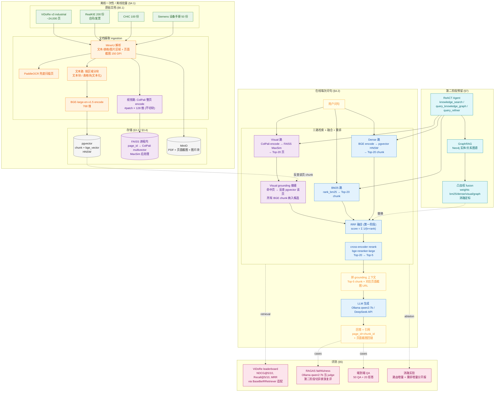
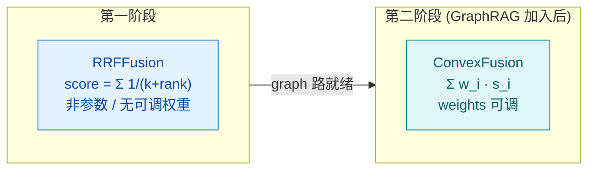
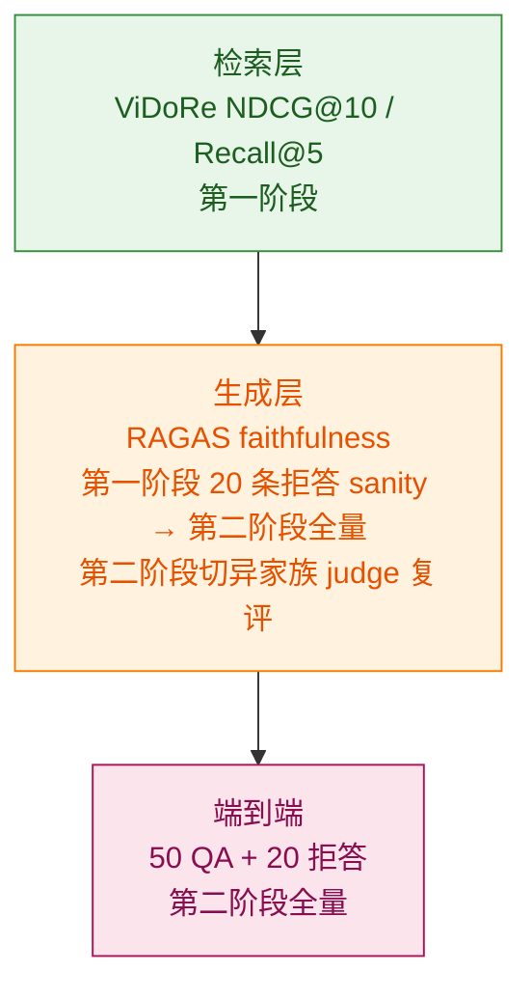
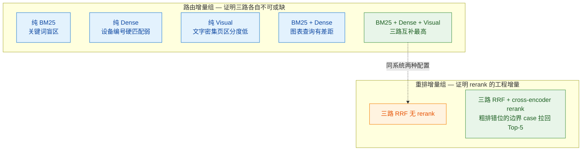

# 工业 PDF 多模态 RAG 系统 — 架构总览

> 单图版架构总览。配套根设计 `industrial-pdf-rag-design.md`（详细条款、决策清单、面试话术）阅读。
> 本文只画图与速读表，所有"为什么这么选"的论证一律回查设计文档对应章节。

---

## 1. 总览图



---

## 2. 关键节点速读

### 离线：原始文档 → 双路索引

| 节点 | 干啥 | 锚点 |
|------|------|------|
| MinerU 解析 | 2026 SOTA 工业级 Pipeline，替代旧版 LayoutLMv3+PyMuPDF+PaddleOCR 三件套 | §3.2 / §4.1 |
| 文本路分块 | 文本块 + 表格块(行列+单元格 文本化)，喂 BGE | §4.1 |
| 视觉路 ColPali | **按页** encode，产出多向量；不切块——切图块会破坏 patch 间 late interaction | §3.2 / §4.1 |
| pgvector | 存 BGE 768 维单向量，HNSW 索引 | §3.2 |
| FAISS | 存 ColPali 多向量，进程内 MaxSim；pgvector 无原生 MaxSim 算子 | §3.2 |

### 在线：问句 → 三路 → 融合 → 重排 → 生成

| 节点 | 干啥 | 锚点 |
|------|------|------|
| BM25 / Dense | chunk 级 Top-20，硬匹配 + 语义两条 | §4.2 |
| Visual 路 | **页级** Top-20，命中后回 pgvector 反查该页所有 BGE chunk | §4.1 接缝 |
| RRF 融合 | 第一阶段非参数 `Σ 1/(k+rank)`，无可调权重，工程上稳 | §4.2 |
| cross-encoder rerank | bge-reranker-large，Top-20 → Top-5 | §3.2 / §4.2 |
| 生成 | Ollama qwen2:7b 本地，复杂场景切 DeepSeek API | §3.2 |

### 评测：三层 + 消融

| 节点 | 干啥 | 锚点 |
|------|------|------|
| ViDoRe | 检索层 NDCG/Recall/MRR，适配 `BaseBeIRRetriever`，不私自重切 corpus | §5.2 |
| RAGAS faithfulness | 生成层"答案没瞎编"，第一阶段先吃 20 条拒答 sanity | §5.1 |
| 端到端 QA | 50 QA + 20 拒答，第二阶段全量 | §5.1 |
| 消融 | 路由增量 + 重排增量两组分开报 | §5.3 |

---

## 3. Visual 路 grounding 接缝（项目最关键的工程接缝）

```mermaid
flowchart LR
    classDef q fill:#e3f2fd,stroke:#1976d2,color:#0d47a1
    classDef v fill:#f3e5f5,stroke:#7b1fa2,color:#4a148c
    classDef t fill:#e8f5e9,stroke:#388e3c,color:#1b5e20
    classDef out fill:#fffde7,stroke:#f9a825,color:#f57f17

    Q[用户问句]:::q --> CE[ColPali encode 查询]:::v
    CE --> MS[FAISS MaxSim 全表扫]:::v
    MS --> TOP[Top-20 页]:::v
    TOP --> REV[反查 pgvector<br/>WHERE page_id IN (命中页)]:::t
    REV --> CH[该页所有 BGE chunk]:::t
    CH --> CAND[纳入 RRF 候选集<br/>与 BM25/Dense 路对齐评分]:::out

    %% 接缝的工程价值
    style REV stroke-width:3px
```

**为什么这条是接缝**：ColPali 只能告诉你"哪一页相关"，不能直接喂生成；必须回到 pgvector 把那一页的文字/表格 chunk 捞出来拼上下文。这一步决定了 Visual 路"看得见图"能不能落地为"答得出字"。面试常在此处追问。

---

## 4. 融合策略阶段性切换（§4.2 / §7.1）



- 用 `FusionStrategy` 接口抽象，调用点不 if/else 硬切。
- 第二阶段权重 `{bm25:0.3, dense:0.45, visual:0.2, graph:0.15}` 由消融定标，不接受拍脑袋。
- RRF → 凸加权不是因为 RRF 错，而是 graph 路得分尺度与前三路不同，需要可调权重做对齐。

---

## 5. 评测分层（§5.1）



**叙事自洽点**：第一阶段不能只看 ViDoRe NDCG——NDCG 高不等于系统好用。20 条拒答 RAGAS 是让"评测驱动迭代"站得住脚的最小必要条件，judge 自评偏好风险已在文档显式承认。

---

## 6. 消融实验读法（§5.3）



**两组分开报**：避免被面试官追问"你的提升到底是检索的功劳还是重排的功劳"。这是评测纪律，不是图表装饰。

---

## 7. 容量与延迟预算速读（§3.4）

| 维度 | 规模 | 单机 32GB 可行性 |
|------|------|----------------|
| ViDoRe 文本索引 | ~70 MB | ✅ 轻量 |
| ViDoRe ColPali 索引 | ~12 GB | ⚠️ 主要内存压力源 |
| Demo 知识库 ColPali 增量 | ~7 GB | 与 ViDoRe 共进程 |
| 单 query 延迟 | 2–5 s | ⚠️ MaxSim 全表扫是瓶颈 |
| Ollama qwen2:7b 常驻 | ~5 GB | 与 FAISS 共享内存 |

**降内存备选**：FAISS HNSW / PQ 量化 → 1–2 GB（精度略降）；在线服务只载 Demo 350 份索引，ViDoRe 离线跑。

---

## 8. 阶段路线图（§2）


---

## 9. 与设计文档章节对照

| 总览图区块 | 设计文档锚点 |
|------------|--------------|
| §1 总览图 离线 ingest | §4.1 文档摄入 |
| §1 总览图 在线 search | §4.2 在线检索 |
| §1 总览图 评测 | §5 评测体系 |
| §1 总览图 第二阶段 | §7 第二阶段预留 |
| §2 速读表 | §3.2 / §4.1 / §4.2 / §5 |
| §3 Visual grounding 接缝 | §4.1 设计要点 |
| §4 融合策略切换 | §4.2 / §7.1 |
| §5 评测分层 | §5.1 |
| §6 消融读法 | §5.3 |
| §7 容量预算 | §3.4 |
| §8 阶段路线图 | §2 开发阶段 |

---

## 10. 与隔壁 `architecture-overview.md` 的关系

`architecture-overview.md` 是 **finqa-rag-agent（财报问答）** 项目的总览图，配套根 spec `2026-06-29-finqa-rag-agent-design.md`，与本文件**不是同一项目**。两份文档刻意分开维护，避免工业 PDF 项目与财报项目的技术选型互相污染。两份的共同点仅在于：都强调"评测驱动迭代"、都用 RRF+cross-encoder rerank、都把 Agent 工具集刻意收窄——这些是同一作者的工程纪律延续，不是项目耦合。